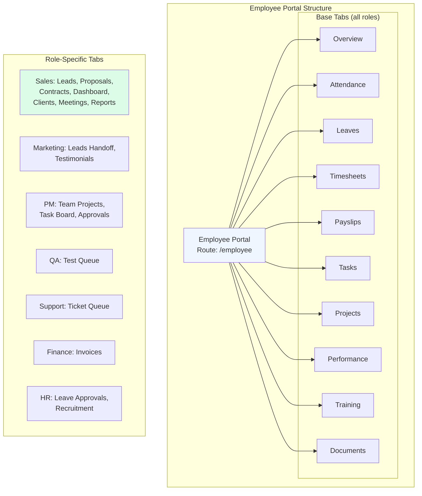

# CoreFusion Technologies — Workflow Document

## 1. Architecture Overview

```
┌─────────────────────────────────────────────────────────────┐
│                     Frontend (React + Vite)                  │
│  33 routes · 4 portals · 10 role-based tabs                 │
│  Tailwind CSS · Supabase JS client · SessionStorage auth    │
└──────────────────────┬──────────────────────────────────────┘
                       │ fetch() → /api/v1/*
                       ▼
┌─────────────────────────────────────────────────────────────┐
│               Backend (FastAPI + SQLAlchemy)                 │
│  42 routers · 45 models · Generic CRUD base                 │
│  Router factory · Role-based access · Pydantic schemas      │
└──────────────────────┬──────────────────────────────────────┘
                       │
                       ▼
┌─────────────────────────────────────────────────────────────┐
│          Database: PostgreSQL (Supabase-hosted)             │
│  5 Alembic migrations · UUID primary keys                   │
│  Auth via Supabase Auth (JWT / JWKS)                        │
└─────────────────────────────────────────────────────────────┘
```

**Deployments:**
- Frontend: Vercel (`cf-azure-eta.vercel.app`)
- Backend: Render
- Database: Supabase (PostgreSQL)

---

## 2. Authentication Flow

### Registration (Client Only)
```
User → /register → Supabase JS signUp() (role: "client" in metadata)
                 → POST /api/v1/auth/register (best-effort backend sync)
                 → User row created in local DB (lazy on first login)
```

### Login
```
User → /login → POST /api/v1/auth/login
              → Backend calls Supabase anon.auth.sign_in_with_password()
              → Backend decodes JWT, looks up/creates local User row
              → Returns { access_token, refresh_token, user }
              → Frontend sets session via supabase.auth.setSession()
```

### Logout
```
User → Sign Out → POST /api/v1/auth/logout (server-side revocation)
               → supabase.auth.signOut() (clears local session)
```

### Token Verification
- Backend verifies tokens via **JWKS** fetched from `{supabase_url}/auth/v1/.well-known/jwks.json`
- Supports HS256 (shared secret), ES256, RS256 (asymmetric)
- JWKS cache with 1-hour TTL, auto-refreshes on key rotation
- All tokens validated with audience `"authenticated"`

### Session Storage
- Uses `window.sessionStorage` (not localStorage) to reduce XSS window
- `persistSession: true`, `detectSessionInUrl: true`

---

## 3. Role System & Access Control

### Role Hierarchy
```
super_admin > admin > hr, project_manager > employee roles > client
```

### Portal Access Matrix

| Portal | Route | Allowed Roles |
|--------|-------|---------------|
| Public | `/`, `/services`, `/portfolio`, `/about`, etc. | Anyone |
| Login | `/login` | Unauthenticated |
| Register | `/register` | Unauthenticated |
| Client Portal | `/client` | `client` |
| Employee Portal | `/employee`, `/sales`, `/marketing`, `/developer`, `/project-manager`, `/qa`, `/support`, `/finance`, `/hr` | `employee`, `developer`, `sales`, `marketing`, `project_manager`, `qa`, `support`, `finance`, `hr`, `admin`, `super_admin` |
| Admin Panel | `/admin` | `admin`, `super_admin` |
| Super Admin | `/super-admin` | `super_admin` |

### Guard Layers
1. **Frontend** — `useRoleGuard(portalKey)` hook: redirects wrong roles immediately (UX only)
2. **Backend** — `require_roles()` FastAPI dependency: enforces access on every protected endpoint

### Employee Portal Tabs by Role

| Role | Extra Tabs (beyond base 10) |
|------|----------------------------|
| `developer` | None |
| `sales` | Leads, Proposals, Contracts |
| `marketing` | Leads Handoff, Testimonials |
| `project_manager` | Team Projects, Task Board, Approvals |
| `qa` | Test Queue |
| `support` | Ticket Queue |
| `finance` | Invoices |
| `hr` | Leave Approvals, Recruitment |

---

## 4. API Architecture

### Base Pattern
- All routes mounted at `/api/v1` prefix
- Uniform response envelope: `{ success, data, message, meta }`
- Generic `CRUDBase[Model]` provides list/get/create/update/delete
- `build_crud_router()` factory generates complete FastAPI routers from schemas

### Standard CRUD Router (via factory)
| Method | Path | Auth | Description |
|--------|------|------|-------------|
| `GET /` | List | Optional | Paginated, filterable, searchable |
| `GET /{id}` | Detail | Optional | Single item |
| `POST /` | Create | write_roles | 201 Created |
| `PUT /{id}` | Update | write_roles | Partial update |
| `DELETE /{id}` | Delete | write_roles | Hard delete |

### API Router Map (42 routers)

| Module | Prefix | Purpose |
|--------|--------|---------|
| `auth` | `/auth` | Login, register, logout, me |
| `users` | `/users` | User CRUD (admin/hr) |
| `employees` | `/employees` | Employee portal + HR management |
| `clients` | `/clients` | Client portal + admin management |
| `projects` | `/projects` | Project lifecycle + team assignment |
| `tasks` | `/tasks` | Task CRUD + status updates |
| `finance` | `/finance` | Invoices, payments, auto-reconciliation |
| `leads` | `/leads` | CRM pipeline |
| `proposals` | `/proposals` | CRM proposals (versioned) |
| `contracts` | `/contracts` | CRM contracts (dual-signature) |
| `tickets` | `/tickets` | Support tickets + replies |
| `meetings` | `/meetings` | Sales/Admin/PM meeting management |
| `notifications` | `/notifications` | In-app notifications |
| `media` | `/media` | File uploads |
| `blogs` | `/blogs` | Blog posts + comments |
| `services` | `/services` | Service pages |
| `case-studies` | `/case-studies` | Case studies |
| `testimonials` | `/testimonials` | Testimonials |
| `careers` | `/careers` | Job postings + applications |
| `contact` | `/contact` | Contact form submissions |
| `downloads` | `/downloads` | Downloadable resources |
| `events` | `/events` | Events |
| `faqs` | `/faqs` | FAQs |
| `gallery` | `/gallery` | Gallery images |
| `portfolio` | `/portfolio` | Portfolio items |
| `products` | `/products` | Products |
| `solutions` | `/solutions` | Solutions |
| `technologies` | `/technologies` | Tech stack |
| `industries` | `/industries` | Industry verticals |
| `awards` | `/awards` | Awards |
| `categories` | `/categories` | Content categories |
| `partners` | `/partners` | Partners |
| `resources` | `/resources` | Resources |
| `trainings` | `/trainings` | Training courses |
| `departments` | `/departments` | Departments (super admin) |
| `access-control` | `/access-control` | Roles + permissions |
| `analytics` | `/analytics` | Page views |
| `reports` | `/reports` | Generated reports |
| `dashboard` | `/dashboard` | Dashboard stats |
| `stats` | `/stats` | Summary statistics |
| `audit-logs` | `/audit-logs` | Audit trail |
| `gdpr` | `/users` (GDPR) | Data export + anonymization |

---

## 5. Database Models (45 models)

### Core Auth
| Model | Table | Key Fields |
|-------|-------|------------|
| `User` | `users` | id, email, name, phone, role, is_active |
| `Role` | `roles` | id, name, slug, description, is_system |
| `Permission` | `permissions` | id, name, module, action |

### HR / Organization
| Model | Table | Key Fields |
|-------|-------|------------|
| `Department` | `departments` | id, name |
| `Employee` | `employees` | id, user_id, employee_code, department_id, designation, salary, status |
| `Attendance` | `attendance` | id, employee_id, date, check_in, check_out, status |
| `Leave` | `leaves` | id, employee_id, type, from_date, to_date, status |
| `Timesheet` | `timesheets` | id, employee_id, project, date, hours, status |
| `Payslip` | `payslips` | id, employee_id, month, year, gross_pay, deductions, net_pay |
| `EmployeeDocument` | `employee_documents` | id, employee_id, name, type, file_url |
| `PerformanceReview` | `performance_reviews` | id, employee_id, period, rating, feedback, goals, achieved |

### Business / Operations
| Model | Table | Key Fields |
|-------|-------|------------|
| `Client` | `clients` | id, user_id, company_name, industry, account_manager_id |
| `ClientFile` | `client_files` | id, client_id, name, file_url, type |
| `ClientReport` | `client_reports` | id, client_id, title, content, generated_by |
| `Project` | `projects` | id, title, slug, client_id, status, progress_percent, budget |
| `Task` | `tasks` | id, project_id, title, assigned_to, priority, status, due_date |
| `Invoice` | `invoices` | id, invoice_number, client_id, amount, tax, total_amount, status |
| `Payment` | `payments` | id, invoice_id, amount, payment_method, status |

### CRM / Sales Pipeline
| Model | Table | Key Fields |
|-------|-------|------------|
| `Lead` | `leads` | id, company, contact_name, email, source, estimated_value, owner_id, status |
| `Proposal` | `proposals` | id, lead_id, scope_summary, price, version, status |
| `Contract` | `contracts` | id, proposal_id, signed_by_client_at, signed_by_company_at |

### CMS / Content (13 models in schemas/cms.py)
| Model | Table | Purpose |
|-------|-------|---------|
| `Blog` | `blogs` | Blog posts |
| `Comment` | `comments` | Blog comments |
| `Service` | `services` | Service pages |
| `CaseStudy` | `case_studies` | Case studies |
| `Testimonial` | `testimonials` | Client testimonials |
| `Download` | `downloads` | Downloadable files |
| `Event` | `events` | Events |
| `Industry` | `industries` | Industry verticals |
| `Technology` | `technologies` | Tech stack |
| `Award` | `awards` | Awards |
| `FAQ` | `faqs` | FAQs |
| `Gallery` | `gallery` | Gallery images |
| `Portfolio` | `portfolio` | Portfolio items |

### Ops / Support
| Model | Table | Purpose |
|-------|-------|---------|
| `Ticket` | `tickets` | Support tickets |
| `TicketReply` | `ticket_replies` | Ticket replies |
| `Meeting` | `meetings` | Client meetings |
| `Notification` | `notifications` | In-app notifications |
| `AuditLog` | `audit_logs` | Audit trail |
| `Media` | `media` | Uploaded files |
| `ContactSubmission` | `contact_submissions` | Contact form entries |

### Training / Analytics
| Model | Table | Purpose |
|-------|-------|---------|
| `Course` | `courses` | Training courses |
| `TrainingEnrollment` | `training_enrollments` | Course enrollments |
| `PageView` | `page_views` | Analytics page views |
| `Report` | `reports` | Generated reports |

### Association Tables
| Table | Purpose |
|-------|---------|
| `project_members` | Many-to-many: Project ↔ Employee |
| `role_permissions` | Many-to-many: Role ↔ Permission |

---

## 6. Key Business Workflows

### 6.1 CRM Pipeline (Lead → Proposal → Contract)
```
1. Sales creates Lead (auto-assigned as owner)
   POST /api/v1/leads { company, contact_name, email, source, estimated_value }

2. Sales creates Proposal for the Lead (version auto-increments)
   POST /api/v1/proposals { lead_id, scope_summary, price }

3. Sales sends Proposal (sets sent_at timestamp)
   PUT /api/v1/proposals/{id} { status: "sent" }

4. Client views → status becomes "viewed" (tracked)

5. Sales accepts Proposal → auto-creates Contract
   POST /api/v1/contracts/{contract_id}/sign { client_signed: true, company_signed: true }

6. Contract signed → can provision client account
   provision_client_account: true creates the client user
```

### 6.2 Employee Lifecycle
```
1. Admin creates User account
   POST /api/v1/users { name, email, password, role: "sales" }

2. Admin creates Employee profile
   POST /api/v1/employees { user_id, employee_code, department_id, designation }

3. Employee self-service:
   - Check in/out: POST /employees/me/attendance/check-in|check-out
   - Apply leave: POST /employees/me/leaves
   - Log timesheet: POST /employees/me/timesheets
   - View payslips: GET /employees/me/payslips
   - View documents: GET /employees/me/documents
   - View performance reviews: GET /employees/me/performance-reviews

4. HR approves leaves: PATCH /employees/leaves/{id}/approve
5. HR approves timesheets: PATCH /employees/timesheets/{id}/approve
```

### 6.3 Client Portal
```
1. Client registers → auto-creates User + Client profile
2. Client views:
   - Projects: GET /clients/me/projects
   - Invoices: GET /clients/me/invoices
   - Payments: GET /clients/me/payments
   - Meetings: GET /clients/me/meetings
   - Files: GET /clients/me/files
   - Reports: GET /clients/me/reports
   - Support tickets: GET /clients/me/tickets
3. Client creates support ticket:
   POST /clients/me/tickets { subject, description, priority }
   → Auto-generates TCK-{timestamp} ticket number
```

### 6.4 Support Ticket Flow
```
1. Client creates ticket via Client Portal
2. Ticket appears in Support employee's "Ticket Queue"
3. Support replies: POST /tickets/{id}/replies { content }
4. Support updates status: PATCH /tickets/{id} { status: "resolved" }
5. Client sees reply in their portal
```

### 6.5 Finance Workflow
```
1. Admin/Finance creates Invoice:
   POST /finance/invoices { client_id, amount, tax, due_date }
   → Auto-generates INV-{timestamp}, computes total_amount = amount + tax

2. Finance records Payment:
   POST /finance/invoices/{id}/payments { amount, payment_method }
   → If cumulative payments ≥ total_amount → invoice auto-marks as "paid"
```

### 6.6 Project Management
```
1. Admin/PM creates Project:
   POST /projects { title, client_id, status, budget }

2. PM assigns Team:
   PATCH /projects/{id}/team { employee_ids: [...] }
   → Uses project_members association table

3. PM creates Tasks:
   POST /tasks { project_id, title, assigned_to, priority, due_date }

4. Employees update Task status:
   PATCH /tasks/{id}/status { status: "in_progress" | "in_review" | "done" }

5. PM tracks progress:
   PUT /projects/{id} { progress_percent: 75 }
```

### 6.7 Testimonial Moderation
```
1. Marketing creates Testimonial:
   POST /api/v1/testimonials { author_name, content, rating, is_published: false }

2. Marketing reviews and approves:
   PUT /api/v1/testimonials/{id} { is_published: true }

3. Published testimonials appear on public website
```

### 6.8 Training & Enrollment
```
1. Admin creates Course:
   POST /api/v1/trainings { title, category, description, duration_hours }

2. Employee browses catalog:
   GET /trainings (available courses)

3. Employee enrolls:
   POST /trainings/enroll { course_id }

4. Admin views enrollments:
   GET /trainings/enrollments?employee_id=...
```

### 6.9 Contact Form → Lead
```
1. Visitor submits contact form:
   POST /api/v1/contact { name, email, message, subject }

2. Admin reviews submissions:
   GET /api/v1/contact

3. Marketing converts to Lead:
   POST /api/v1/leads { contact_submission_id: "...", ... }
```

---

## 7. Frontend Portal Layout

### Shared Layout Pattern (all portals)
```
┌──────────────────────────────────────────────────┐
│ Header: Avatar · Portal Title · User Info · Sign Out │  ← sticky, #0d2240
├────────┬─────────────────────────────────────────┤
│ Sidebar│  Content Area (scrollable)               │
│ w-56   │  ┌─────────────────────────────────┐     │
│ #0d2240│  │ KPI Stat Cards (grid)            │     │
│        │  ├─────────────────────────────────┤     │
│ Nav    │  │ Section Heading                  │     │
│ Items  │  ├─────────────────────────────────┤     │
│        │  │ Card Grid (sm:2, lg:3)           │     │
│        │  │ ┌─────┐ ┌─────┐ ┌─────┐        │     │
│        │  │ │Card │ │Card │ │Card │        │     │
│        │  │ └─────┘ └─────┘ └─────┘        │     │
│        │  └─────────────────────────────────┘     │
└────────┴─────────────────────────────────────────┘
  ← fixed h-screen, only content scrolls
  ← bg: #102C4F
```

### Card Pattern (consistent across all portals)
```html
<div class="flex flex-col rounded-xl border border-slate-200 bg-white p-6 shadow-sm">
  <div class="mb-4 inline-flex size-11 items-center justify-center rounded-xl bg-blue-50">
    <Icon class="text-2xl text-blue-600" />
  </div>
  <p class="font-display text-body-md font-semibold text-slate-900">Title</p>
  <p class="mt-1 text-body-xs uppercase tracking-wide text-slate-600">Subtitle</p>
  <p class="mt-2 flex-1 text-body-sm text-slate-600">Description</p>
  <div class="mt-4 flex items-center justify-between">Footer actions</div>
</div>
```

### KPI Stat Card Pattern
```html
<div class="flex flex-col rounded-xl border border-slate-200 bg-white p-6 shadow-sm">
  <div class="mb-4 inline-flex size-11 items-center justify-center rounded-xl bg-blue-50">
    <Icon class="text-2xl text-blue-600" />
  </div>
  <p class="font-stat text-3xl font-bold text-slate-900">{value}</p>
  <p class="mt-1 font-label-caps text-label-caps uppercase text-slate-500">{label}</p>
</div>
```

---

## 8. Frontend Route Map (33 routes)

### Public Pages
| Route | Component | Description |
|-------|-----------|-------------|
| `/` | Home | Landing page |
| `/about` | About | Company info + team |
| `/services` | Services | Service listing |
| `/services/:slug` | ServiceDetail | Individual service |
| `/portfolio` | Portfolio | Portfolio grid |
| `/portfolio/success/:slug` | SuccessStory | Individual success story |
| `/solutions` | Solutions | Solutions listing |
| `/products` | Products | Products listing |
| `/technologies` | Technologies | Tech stack |
| `/industries` | Industries | Industry verticals |
| `/case-studies` | CaseStudies | Case studies |
| `/careers` | Careers | Job listings |
| `/blog` | Blog | Blog listing |
| `/events` | Events | Events |
| `/gallery` | Gallery | Image gallery |
| `/awards` | Awards | Awards |
| `/downloads` | Downloads | Downloadable resources |
| `/resources` | Resources | Resources |
| `/faq` | Faq | FAQ page |
| `/contact` | Contact | Contact form |
| `/privacy` | Privacy | Privacy policy |
| `/terms` | Terms | Terms of service |
| `/cookies` | Cookies | Cookie policy |

### Portal Pages
| Route | Component | Description |
|-------|-----------|-------------|
| `/login` | LoginPage | General login |
| `/register` | Register | Client registration |
| `/client` | ClientPortal | Client self-service |
| `/employee` | EmployeePortal | Employee portal (base) |
| `/sales` | EmployeePortal | Sales role portal |
| `/marketing` | EmployeePortal | Marketing role portal |
| `/developer` | EmployeePortal | Developer role portal |
| `/project-manager` | EmployeePortal | PM role portal |
| `/qa` | EmployeePortal | QA role portal |
| `/support` | EmployeePortal | Support role portal |
| `/finance` | EmployeePortal | Finance role portal |
| `/hr` | EmployeePortal | HR role portal |
| `/admin` | AdminPanel | Admin dashboard |
| `/super-admin` | SuperAdminPanel | Super admin panel |
| `/super-admin/login` | SuperAdminLogin | Super admin login |

### Utility
| Route | Component |
|-------|-----------|
| `/brochure` | BrochurePage |
| `/download/:slug` | DownloadDetail |
| `*` | NotFound (404) |

---

## 9. Portal Tab Overview

### Admin Panel (11 tabs)
| Tab | Content |
|-----|---------|
| Dashboard | KPI cards, project summaries |
| Content | Blog, services, case studies CRUD |
| Projects | Project list + management |
| Users | User account management |
| Employees | Employee profiles |
| Clients | Client management |
| Roles | Role + permission management |
| Media | File uploads |
| Notifications | Notification management |
| Reports | Generated reports |
| Audit Logs | Activity audit trail |

### Client Portal (8 tabs)
| Tab | Content |
|-----|---------|
| Overview | KPI cards, project summary |
| Projects | Client's projects |
| Invoices | Client's invoices |
| Payments | Payment history |
| Files | Shared files |
| Meetings | Scheduled meetings |
| Reports | Client reports |
| Support | Support tickets |

### Employee Portal — Base Tabs (10 tabs, all roles)
| Tab | Content |
|-----|---------|
| Overview | Attendance, profile, KPI cards |
| Attendance | Check-in/out, status cards |
| Leaves | Apply + view leave requests |
| Timesheets | Log + view hours |
| Payslips | View payslips |
| Tasks | Assigned tasks |
| Projects | Assigned projects |
| Performance | Reviews + ratings |
| Training | Course catalog + enrollments |
| Documents | Employee documents |

### Employee Portal — Role-Specific Tabs
| Role | Additional Tabs |
|------|-----------------|
| Sales | Leads, Proposals, Contracts, Dashboard, Clients, Meetings, Reports |
| Marketing | Leads Handoff, Testimonials |
| Project Manager | Team Projects, Task Board, Approvals |
| QA | Test Queue |
| Support | Ticket Queue |
| Finance | Invoices |
| HR | Leave Approvals, Recruitment |

---

## 10. Key Auto-Provisioning Logic

### Client Profile
- On first access to `/clients/me/profile`, if no Client record exists for the authenticated user, one is **automatically created** with a placeholder company name derived from the email.

### Employee Profile
- On first access to `/employees/me/profile`, if no Employee record exists for the authenticated user (with an employee-type role), one is **automatically created** with:
  - Employee code: `EMP-{short_id}`
  - Default department
  - Status: `active`

### Invoice Numbering
- Auto-generated: `INV-{timestamp}` (e.g., `INV-1724000000`)

### Ticket Numbering
- Auto-generated: `TCK-{timestamp}` (e.g., `TCK-1724000000`)

### Invoice Auto-Payment
- When cumulative `completed` payments ≥ `total_amount`, invoice status automatically changes to `"paid"`

---

## 11. Environment Variables

### Frontend (.env)
| Variable | Purpose |
|----------|---------|
| `VITE_API_URL` | Backend API base URL (fallback: `/api/v1`) |
| `VITE_SUPABASE_URL` | Supabase project URL |
| `VITE_SUPABASE_ANON_KEY` | Supabase anonymous/public key |

### Backend
| Variable | Purpose |
|----------|---------|
| `SUPABASE_URL` | Supabase project URL |
| `SUPABASE_ANON_KEY` | Supabase anonymous key |
| `SUPABASE_SERVICE_ROLE_KEY` | Supabase service role key (server-side) |
| `SUPABASE_JWT_SECRET` | JWT secret for HS256 verification |
| `DATABASE_URL` | PostgreSQL connection string |
| `DB_USE_PGBOUNCER` | Use transaction pooler (port 6543) |

---

## 12. Development Commands

### Frontend
```bash
cd frontend
npm install          # Install dependencies
npm run dev          # Start dev server (port 5173)
npm run build        # Production build
npm run lint         # ESLint check
```

### Backend
```bash
cd backend
pip install -r requirements.txt    # Install dependencies
uvicorn app.main:app --reload      # Start dev server (port 8000)
alembic upgrade head               # Run migrations
```

---

## 13. Deployment Flow

### Frontend (Vercel)
```
git push → Vercel auto-deploys → cf-azure-eta.vercel.app
```

### Backend (Render)
```
git push → Render auto-deploys → {render-url}.onrender.com
```

### Database Migrations
```
alembic revision --autogenerate -m "description"   # Generate migration
alembic upgrade head                                # Apply migration
```

---

## 14. File Structure

```
CF/
├── frontend/
│   ├── src/
│   │   ├── api/              # API client + endpoint functions
│   │   │   ├── client.js     # fetch() wrapper + error handling
│   │   │   ├── auth.js       # Login/register/logout
│   │   │   ├── admin.js      # Admin + employee + CRM APIs
│   │   │   ├── employees.js  # Employee self-service APIs
│   │   │   ├── clients.js    # Client portal APIs
│   │   │   └── crm.js        # CRM pipeline APIs
│   │   ├── components/       # Reusable UI components
│   │   │   ├── ui/           # Icon, Avatar, Button, StatusBadge, etc.
│   │   │   ├── about/        # About page components
│   │   │   ├── services/     # Service page components
│   │   │   └── admin/        # Admin-specific components
│   │   ├── context/          # React context (AuthContext)
│   │   ├── data/             # Static data (services, about, portal tabs)
│   │   ├── hooks/            # Custom hooks (useRoleGuard, usePageViewTracker)
│   │   ├── lib/              # Supabase client config
│   │   ├── pages/            # Route components (33 pages)
│   │   ├── styles/           # CSS + Tailwind config
│   │   ├── utils/            # Utilities (documentPdf, etc.)
│   │   └── App.jsx           # Route definitions + Layout
│   ├── package.json
│   └── vite.config.js
│
├── backend/
│   ├── app/
│   │   ├── core/             # Config, security, database, responses
│   │   │   ├── config.py     # Pydantic BaseSettings (all env vars)
│   │   │   ├── security.py   # JWT/JWKS verification
│   │   │   ├── database.py   # SQLAlchemy async engine + session
│   │   │   └── responses.py  # Uniform response envelope
│   │   ├── crud/             # Generic CRUD base class
│   │   ├── models/           # 45 SQLAlchemy models
│   │   ├── routers/          # 42 FastAPI routers
│   │   ├── schemas/          # Pydantic schemas (~28 files)
│   │   └── utils/            # Router factory, pagination, notifications
│   ├── alembic/              # Database migrations (5 versions)
│   ├── tests/                # Test suite
│   ├── main.py               # FastAPI app entry point
│   └── requirements.txt
│
├── WORKFLOW.md               # This document
├── ROLE_WORKFLOW.md          # Role-specific tab definitions
└── .git/
```

---

## 15. Workflow Flowcharts

### 15.1 Authentication Flow

```mermaid
flowchart TD
    A[User visits /login] --> B{Has Supabase session?}
    B -->|No| C[Enter email + password]
    C --> D[Supabase JS signUp/signIn]
    D --> E[Server: POST /auth/login]
    E --> F[Backend calls Supabase auth.sign_in_with_password]
    F --> G[Backend verifies JWKS<br/>audience: "authenticated"<br/>cache TTL: 1hr]
    G --> H[Backend finds/creates local User row]
    H --> I[Returns access_token + refresh_token + user]
    I --> J[Frontend: supabase.auth.setSession]
    J --> K[sessionStorage with tokens]
    
    B -->|Yes| K
    
    K --> L[Access protected route]
    L --> M[Frontend useRoleGuard]
    M --> N{Role allowed?}
    N -->|No| O[Redirect to /login]
    N -->|Yes| P[Backend require_roles]
    P --> Q{Role allowed?}
    Q -->|No| R[403 Forbidden]
    Q -->|Yes| S[Render page content]

    style A fill:#e0f2fe
    style K fill:#dcfce8
    style L fill:#f0fdf4
```

### 15.2 CRM Pipeline (Lead → Proposal → Contract → Client)

```mermaid
flowchart TD
    A[Sales creates Lead<br/>POST /leads] --> B[Lead auto-assigned as owner]
    B --> C[Lead status: new]
    
    C --> D[Sales creates Proposal<br/>POST /proposals]
    D --> E[Proposal version auto-increments]
    E --> F[Proposal status: draft]
    
    F --> G[Sales sends Proposal<br/>PUT /proposals/{id}<br/>status: sent]
    G --> H{Client views proposal?}
    H -->|Yes| I[status: viewed]
    H -->|No| G
    
    I --> J{Client accepts?}
    J -->|Yes| K[POST /contracts/{id}/sign<br/>client_signed: true]
    J -->|No| G
    
    K --> L[Company signs contract<br/>POST /contracts/{id}/sign<br/>company_signed: true]
    L --> M[Contract status: signed]
    
    M --> N{provision_client_account?}
    N -->|true| O[Creates Client user account]
    N -->|false| P[No client provisioning]
    O --> Q[Client receives welcome email]
    
    subgraph "Sales Workspace Tabs"
        S1[CRM Dashboard]
        S2[Leads]
        S3[Proposals]
        S4[Contracts]
        S5[Meetings]
        S6[Clients]
        S7[Reports]
    end
    
    A -.-> S2
    D -.-> S3
    K -.-> S4
    
    style A fill:#dbeafe
    style O fill:#dcfce8
```

### 15.3 Employee Lifecycle (HR + Self-Service)

```mermaid
flowchart LR
    subgraph "HR Admin Flow"
        A1[Admin creates User<br/>POST /users] --> A2[Admin creates Employee<br/>POST /employees]
    end
    
    subgraph "Employee Self-Service"
        B1[Check in/out<br/>GET/POST /employees/me/attendance]
        B2[Apply leave<br/>POST /employees/me/leaves]
        B3[Log timesheet<br/>POST /employees/me/timesheets]
        B4[View payslips<br/>GET /employees/me/payslips]
        B5[View documents<br/>GET /employees/me/documents]
        B6[View reviews<br/>GET /employees/me/performance-reviews]
    end
    
    subgraph "HR Actions"
        C1[Approve leaves<br/>PATCH /employees/leaves/{id}/approve]
        C2[Approve timesheets<br/>PATCH /employees/timesheets/{id}/approve]
    end
    
    A2 --> B1
    A2 --> B2
    A2 --> B3
    A2 --> B4
    A2 --> B5
    A2 --> B6
    
    B2 --> C1
    B3 --> C2
    
    style A1 fill:#fef3c7
    style B1 fill:#e0f2fe
```

### 15.4 Client Portal Access

```mermaid
flowchart TD
    A[Client visits /register] --> B[Fill form: name, email, password]
    B --> C[Supabase signUp<br/>role: "client" in metadata]
    C --> D[Backend POST /auth/register<br/>best-effort User row sync]
    D --> E[Login]
    E --> F[POST /auth/login]
    F --> G[Backend decodes JWT<br/>creates local User row if missing]
    G --> H[First access to<br/>/clients/me/profile]
    H --> I{Client record exists?}
    
    I -->|No| J[Auto-create Client profile<br/>Company = placeholder from email]
    I -->|Yes| K[Load existing Client]
    
    J --> L[Redirect to /client]
    K --> L
    
    L --> M[Dashboard: KPI cards]
    L --> N[Projects: GET /clients/me/projects]
    L --> O[Invoices: GET /clients/me/invoices]
    L --> P[Payments: GET /clients/me/payments]
    L --> Q[Meetings: GET /clients/me/meetings]
    L --> R[Files: GET /clients/me/files]
    L --> S[Reports: GET /clients/me/reports]
    L --> T[Tickets: GET /clients/me/tickets]
    
    T --> U[Create support ticket<br/>POST /clients/me/tickets]
    U --> V[Ticket auto-numbered<br/>TCK-{timestamp}]
    
    style A fill:#fef3c7
    style J fill:#dcfce8
```

### 15.5 Support Ticket Flow

```mermaid
flowchart TD
    A[Client creates ticket<br/>POST /clients/me/tickets] --> B[Ticket auto-numbered TCK-{ts}]
    B --> C[Ticket status: open]
    
    C --> D[Ticket appears in<br/>Support's Ticket Queue]
    D --> E[Support claims/assigns<br/>PATCH /tickets/{id}<br/>assigned_to: user_id]
    
    E --> F[Support changes status<br/>PATCH /tickets/{id}<br/>status: in_progress]
    
    F --> G[Support replies<br/>POST /tickets/{id}/replies]
    G --> H[Reply saved + Client notified]
    H --> I{Issue resolved?}
    I -->|No| F
    I -->|Yes| J[Support marks resolved<br/>PATCH /tickets/{id}<br/>status: resolved]
    J --> K[Client sees resolution<br/>in Client Portal]
    
    style A fill:#dbeafe
    J ~~~ L{Closed by client?}
    L -->|Yes| M[status: closed]
    L -->|No| N[status stays resolved]
    
    style J fill:#dcfce8
```

### 15.6 Finance Workflow (Invoicing + Auto-Payment)

```mermaid
flowchart TD
    A[Admin/Finance creates invoice<br/>POST /finance/invoices] --> B[Auto-generates INV-{timestamp}]
    B --> C[Computes total_amount = amount + tax]
    C --> D[Invoice status: draft]
    
    D --> E[Finance sends invoice<br/>PATCH /finance/invoices/{id}<br/>status: sent]
    E --> F[Client sees invoice<br/>in /client portal]
    
    F --> G[Client records payment<br/>POST /finance/invoices/{id}/payments]
    G --> H[Cumulative payments += amount]
    
    H --> I[cumulative >= total_amount?}
    I -->|Yes| J[Auto-mark status: paid]
    I -->|No| K[Status stays: sent]
    
    J --> L[Client sees paid status]
    K --> M[Client can pay more]
    M --> G
    
    style A fill:#fef3c7
    style J fill:#dcfce8
```

### 15.7 Project Management

```mermaid
flowchart TD
    A[Admin/PM creates project<br/>POST /projects] --> B[Status: planning]
    
    B --> C[PM assigns team<br/>PATCH /projects/{id}/team<br/>employee_ids: [...]]
    C --> D[project_members association table updated]
    
    B --> E[PM creates tasks<br/>POST /tasks]
    E --> F[Tasks assigned to employees]
    
    F --> G[Employee updates task<br/>PATCH /tasks/{id}/status]
    G --> H{Status = done?}
    H -->|Yes| I[Task completed]
    H -->|No| J[Continue work]
    
    I --> K[PM updates progress<br/>PUT /projects/{id}<br/>progress_percent: +25%]
    K --> L[Progress auto-tracked]
    
    L --> M{progress = 100?}
    M -->|Yes| N[Project status: completed]
    M -->|No| K
    
    N --> O[Notify stakeholders]
    
    style A fill:#dbeafe
    style N fill:#dcfce8
```

### 15.8 Employee Portal Tab Mapping



---

## 16. Appendix: Key Configuration Values

### Backend (`settings.py`)
| Setting | Source |
|---------|--------|
| `SUPABASE_URL` | Environment |
| `SUPABASE_JWT_SECRET` | Environment (HS256 fallback) |
| `DATABASE_URL` | Environment (`.env`) |
| `DB_USE_PGBOUNCER` | `true` in production |
| `CORS_ORIGINS` | `localhost:5173`, `vercel.app` |

### Frontend (`.env`)
| Variable | Default |
|----------|---------|
| `VITE_API_URL` | `/api/v1` |
| `VITE_SUPABASE_URL` | — |
| `VITE_SUPABASE_ANON_KEY` | — |

---

## 15. Workflow Flowcharts

### 15.1 Authentication Flow

```mermaid
flowchart TD
    A[User visits /login] --> B{Has Supabase session?}
    B -->|No| C[Enter email + password]
    C --> D[Supabase JS signUp/signIn]
    D --> E[Server: POST /auth/login]
    E --> F[Backend calls Supabase auth.sign_in_with_password]
    F --> G[Backend verifies JWKS<br/>audience: "authenticated"<br/>cache TTL: 1hr]
    G --> H[Backend finds/creates local User row]
    H --> I[Returns access_token + refresh_token + user]
    I --> J[Frontend: supabase.auth.setSession]
    J --> K[sessionStorage with tokens]
    
    B -->|Yes| K
    
    K --> L[Access protected route]
    L --> M[Frontend useRoleGuard]
    M --> N{Role allowed?}
    N -->|No| O[Redirect to /login]
    N -->|Yes| P[Backend require_roles]
    P --> Q{Role allowed?}
    Q -->|No| R[403 Forbidden]
    Q -->|Yes| S[Render page content]

    style A fill:#e0f2fe
    style K fill:#dcfce8
    style L fill:#f0fdf4
```

### 15.2 CRM Pipeline (Lead → Proposal → Contract → Client)

```mermaid
flowchart TD
    A[Sales creates Lead<br/>POST /leads] --> B[Lead auto-assigned as owner]
    B --> C[Lead status: new]
    
    C --> D[Sales creates Proposal<br/>POST /proposals]
    D --> E[Proposal version auto-increments]
    E --> F[Proposal status: draft]
    
    F --> G[Sales sends Proposal<br/>PUT /proposals/{id}<br/>status: sent]
    G --> H{Client views proposal?}
    H -->|Yes| I[status: viewed]
    H -->|No| G
    
    I --> J{Client accepts?}
    J -->|Yes| K[POST /contracts/{id}/sign<br/>client_signed: true]
    J -->|No| G
    
    K --> L[Company signs contract<br/>POST /contracts/{id}/sign<br/>company_signed: true]
    L --> M[Contract status: signed]
    
    M --> N{provision_client_account?}
    N -->|true| O[Creates Client user account]
    N -->|false| P[No client provisioning]
    O --> Q[Client receives welcome email]
    
    subgraph "Sales Workspace Tabs"
        S1[CRM Dashboard]
        S2[Leads]
        S3[Proposals]
        S4[Contracts]
        S5[Meetings]
        S6[Clients]
        S7[Reports]
    end
    
    A -.-> S2
    D -.-> S3
    K -.-> S4
    
    style A fill:#dbeafe
    style O fill:#dcfce8
```

### 15.3 Employee Lifecycle (HR + Self-Service)

```mermaid
flowchart LR
    subgraph "HR Admin Flow"
        A1[Admin creates User<br/>POST /users] --> A2[Admin creates Employee<br/>POST /employees]
    end
    
    subgraph "Employee Self-Service"
        B1[Check in/out<br/>GET/POST /employees/me/attendance]
        B2[Apply leave<br/>POST /employees/me/leaves]
        B3[Log timesheet<br/>POST /employees/me/timesheets]
        B4[View payslips<br/>GET /employees/me/payslips]
        B5[View documents<br/>GET /employees/me/documents]
        B6[View reviews<br/>GET /employees/me/performance-reviews]
    end
    
    subgraph "HR Actions"
        C1[Approve leaves<br/>PATCH /employees/leaves/{id}/approve]
        C2[Approve timesheets<br/>PATCH /employees/timesheets/{id}/approve]
    end
    
    A2 --> B1
    A2 --> B2
    A2 --> B3
    A2 --> B4
    A2 --> B5
    A2 --> B6
    
    B2 --> C1
    B3 --> C2
    
    style A1 fill:#fef3c7
    style B1 fill:#e0f2fe
```

### 15.4 Client Portal Access

```mermaid
flowchart TD
    A[Client visits /register] --> B[Fill form: name, email, password]
    B --> C[Supabase signUp<br/>role: "client" in metadata]
    C --> D[Backend POST /auth/register<br/>best-effort User row sync]
    D --> E[Login]
    E --> F[POST /auth/login]
    F --> G[Backend decodes JWT<br/>creates local User row if missing]
    G --> H[First access to<br/>/clients/me/profile]
    H --> I{Client record exists?}
    
    I -->|No| J[Auto-create Client profile<br/>Company = placeholder from email]
    I -->|Yes| K[Load existing Client]
    
    J --> L[Redirect to /client]
    K --> L
    
    L --> M[Dashboard: KPI cards]
    L --> N[Projects: GET /clients/me/projects]
    L --> O[Invoices: GET /clients/me/invoices]
    L --> P[Payments: GET /clients/me/payments]
    L --> Q[Meetings: GET /clients/me/meetings]
    L --> R[Files: GET /clients/me/files]
    L --> S[Reports: GET /clients/me/reports]
    L --> T[Tickets: GET /clients/me/tickets]
    
    T --> U[Create support ticket<br/>POST /clients/me/tickets]
    U --> V[Ticket auto-numbered<br/>TCK-{timestamp}]
    
    style A fill:#fef3c7
    style J fill:#dcfce8
```

### 15.5 Support Ticket Flow

```mermaid
flowchart TD
    A[Client creates ticket<br/>POST /clients/me/tickets] --> B[Ticket auto-numbered TCK-{ts}]
    B --> C[Ticket status: open]
    
    C --> D[Ticket appears in<br/>Support's Ticket Queue]
    D --> E[Support claims/assigns<br/>PATCH /tickets/{id}<br/>assigned_to: user_id]
    
    E --> F[Support changes status<br/>PATCH /tickets/{id}<br/>status: in_progress]
    
    F --> G[Support replies<br/>POST /tickets/{id}/replies]
    G --> H[Reply saved + Client notified]
    H --> I{Issue resolved?}
    I -->|No| F
    I -->|Yes| J[Support marks resolved<br/>PATCH /tickets/{id}<br/>status: resolved]
    J --> K[Client sees resolution<br/>in Client Portal]
    
    style A fill:#dbeafe
    J ~~~ L{Closed by client?}
    L -->|Yes| M[status: closed]
    L -->|No| N[status stays resolved]
    
    style J fill:#dcfce8
```

### 15.6 Finance Workflow (Invoicing + Auto-Payment)

```mermaid
flowchart TD
    A[Admin/Finance creates invoice<br/>POST /finance/invoices] --> B[Auto-generates INV-{timestamp}]
    B --> C[Computes total_amount = amount + tax]
    C --> D[Invoice status: draft]
    
    D --> E[Finance sends invoice<br/>PATCH /finance/invoices/{id}<br/>status: sent]
    E --> F[Client sees invoice<br/>in /client portal]
    
    F --> G[Client records payment<br/>POST /finance/invoices/{id}/payments]
    G --> H[Cumulative payments += amount]
    
    H --> I[cumulative >= total_amount?]
    I -->|Yes| J[Auto-mark status: paid]
    I -->|No| K[Status stays: sent/sent]
    
    J --> L[Client sees paid status]
    K --> M[Client can pay more]
    M --> G
    
    style A fill:#fef3c7
    style J fill:#dcfce8
```

### 15.7 Project Management

```mermaid
flowchart TD
    A[Admin/PM creates project<br/>POST /projects] --> B[Status: planning]
    
    B --> C[PM assigns team<br/>PATCH /projects/{id}/team<br/>employee_ids: [...]]
    C --> D[project_members association table updated]
    
    B --> E[PM creates tasks<br/>POST /tasks]
    E --> F[Tasks assigned to employees]
    
    F --> G[Employee updates task<br/>PATCH /tasks/{id}/status]
    G --> H{Status = done?}
    H -->|Yes| I[Task completed]
    H -->|No| J[Continue work]
    
    I --> K[PM updates progress<br/>PUT /projects/{id}<br/>progress_percent: +25%]
    K --> L[Progress auto-tracked]
    
    L --> M{progress = 100?}
    M -->|Yes| N[Project status: completed]
    M -->|No| K
    
    N --> O[Notify stakeholders]
    
    style A fill:#dbeafe
    style N fill:#dcfce8
```

### 15.8 Employee Portal Tab Mapping


---

## 16. Appendix: Key Configuration Values

### Backend (`settings.py`)
| Setting | Source |
|---------|--------|
| `SUPABASE_URL` | Environment |
| `SUPABASE_JWT_SECRET` | Environment (HS256 fallback) |
| `DATABASE_URL` | Environment (`.env`) |
| `DB_USE_PGBOUNCER` | `true` in production |
| `CORS_ORIGINS` | `localhost:5173`, `vercel.app` |

### Frontend (`.env`)
| Variable | Default |
|----------|---------|
| `VITE_API_URL` | `/api/v1` |
| `VITE_SUPABASE_URL` | — |
| `VITE_SUPABASE_ANON_KEY` | — |
