# CoreFusion Technologies — Role-Based Workflow & Platform Specification

> Grounded in the actual codebase (`corefusion-platform`): FastAPI + SQLAlchemy 2.0 + Supabase Auth/Postgres backend, React 18 + Vite + Tailwind frontend. Real enums, models and routers are referenced by name throughout. Where the current schema doesn't yet cover a requirement (e.g. CRM lead pipeline), it is called out explicitly as a **GAP → build** item rather than silently invented.

**Roles already defined in `backend/app/models/enums.py::UserRole`:**
`super_admin · admin · hr · sales · marketing · project_manager · developer · qa · support · finance · client · employee · guest`

This document treats `employee` as the umbrella account type and the 7 departmental roles (hr, sales, marketing, project_manager, developer, qa, support, finance) as its specializations — matching how `role` is stored as a single column on `users`.

---

## Table of Contents

1. [RBAC Foundation](#1-rbac-foundation)
2. [Role Workflows (13 roles × 12 sections)](#2-role-workflows)
3. [End-to-End Business Workflow](#3-end-to-end-business-workflow)
4. [Project & Lead Lifecycle](#4-project--lead-lifecycle)
5. [Role Interaction Matrix](#5-role-interaction-matrix)
6. [Approval Workflows](#6-approval-workflows)
7. [Dashboard Wireframes](#7-dashboard-wireframes)
8. [Database Mapping](#8-database-mapping)
9. [API Mapping](#9-api-mapping)
10. [UI Screens by Role](#10-ui-screens-by-role)

---

## 1. RBAC Foundation

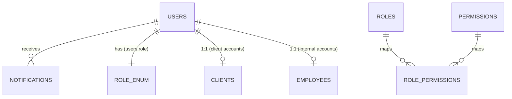

- **Auth**: Supabase Auth issues the JWT (signup/login/reset/MFA). The backend never stores a password — `users.id` == `auth.users.id`. `AuthContext.jsx` on the frontend persists the session and drives route guarding.
- **Coarse-grained RBAC**: `users.role` (the `UserRole` enum) — used for route/portal gating (`ProtectedRoute`, FastAPI `Depends(require_role(...))`).
- **Fine-grained RBAC**: the `roles` / `permissions` / `role_permissions` tables (`app/models/role.py`, `permission.py`, `associations.py`) — `Permission.module` + `Permission.action` (e.g. `module="invoices", action="approve"`). This is the layer that should back the **View/Create/Edit/Delete/Approve/Export/Assign/Manage** matrices below, letting Super Admin tune access per role without a code deploy.
- **Row-level scoping**: `client_id`, `assigned_to`, `project_manager_id`, `account_manager_id` FKs enforce "own records only" scoping (a Client only sees rows where `clients.user_id = current_user.id`; a Developer only sees tasks where `assigned_to = current_user.id`).

**Permission legend used throughout:** ✅ full · 🔶 own/assigned records only · ❌ none

---

## 2. Role Workflows

Each role follows this fixed template: Purpose · Login Flow · Dashboard · Navigation Menu · Permissions · Daily Workflow · Actions · Notifications · Reports · KPIs · Integrations · AI Features.

---

### 2.1 Guest

**Purpose:** Anonymous visitor evaluating CoreFusion as a vendor — the top of the funnel, pre-authentication.

**Login Flow:** No login. Full public site access (`Home, Services, Solutions, Products, Technologies, Industries, Portfolio, CaseStudies, About, Careers, Blog, Events, Gallery, Awards, Downloads, Resources, Faq`). CTA buttons (`Get a Quote`, `Contact Sales`) open `Contact.jsx` or trigger `LoginModal` for existing accounts. `Register.jsx` is only reachable via an invite/proposal-acceptance link, not self-serve signup — client accounts are provisioned by Sales/PM after contract signature (see §4).

**Dashboard:** None (no authenticated session).

**Navigation Menu:**
```
Public Navbar
├── Home
├── Services ▾ (Web, Mobile, Cloud, AI/ML, DevOps, Consulting)
├── Solutions / Products / Technologies / Industries
├── Portfolio / Case Studies
├── Company ▾ (About, Careers, Blog, Events, Gallery, Awards)
├── Resources ▾ (Downloads, Resources, FAQ)
├── Contact
└── [Login] [Get a Quote →]
```

**Permissions:** View: ✅ (public content only) · Create: 🔶 (contact form + career application only) · Edit/Delete/Approve/Export/Assign/Manage: ❌

**Daily Workflow:**
1. Lands via SEO/ads/referral → browses Services/Solutions/Case Studies.
2. Filters Portfolio by industry/technology to validate credibility.
3. Reads a Case Study or downloads a brochure/whitepaper (`BrochurePage.jsx`, `downloads.js`) — lead-magnet gate captures email.
4. Submits `Contact.jsx` form (name, email, company, department, subject, message) → creates a `contact_submissions` row (`ContactStatus.new`).
5. Optionally applies to a job via `Careers.jsx` → creates an `applications` row.

**Actions:** Browse content, filter/search portfolio & blog, submit contact form, apply for a job, download resources, subscribe to newsletter.

**Notifications:** Receives: auto-reply email ("We received your message"). Sends: none (system-generated only).

**Reports:** None.

**KPIs (tracked by Marketing about Guests, not by the Guest):** Sessions, bounce rate, CTA click-through rate, contact-form conversion rate, time-to-first-response.

**Integrations:** Google Analytics/GA4, reCAPTCHA on forms, email (transactional auto-reply via SMTP/SES), newsletter provider (Mailchimp/SendGrid).

**AI Features:** AI chat concierge (pre-sales Q&A bot fed by services/case-study content), AI-suggested related case studies based on browsing pattern, smart contact-form routing (classify `subject`/`message` → auto-set `department` and priority before it reaches Sales).

---

### 2.2 Client

**Purpose:** The paying customer who owns one or more projects; consumes delivery status, files, invoices, and support without touching internal operations.

**Login Flow:** Email+password or magic link via Supabase Auth → JWT stored client-side (per `AuthContext.jsx`, explicit `localStorage` persistence) → redirected to `/client-portal` (`ClientPortal.jsx`). Account is created by Sales/PM at onboarding (§4), not self-registered. MFA optional, enforced for account holders with invoice/payment access.

**Dashboard (`clientPortalTabs` → `overview`):**
- Active projects count + overall progress % (ring chart, from `Project.progress_percent`)
- Outstanding balance (sum of unpaid `invoices.total_amount`) + next due date
- Open support tickets count (by priority)
- Upcoming meetings (next 3, from `Meeting`)
- Recent files shared (`ClientFile`, last 5)
- Recent activity feed (status changes, new invoice, new report)
- Quick actions: Raise Ticket · Pay Invoice · Schedule Meeting · Download Report

**Navigation Menu:**
```
Client Portal
├── Overview
├── Projects            (list → detail: timeline, tasks visible read-only, files, cover/video)
├── Invoices & Payments  (view, pay via gateway, download PDF)
├── Files                (ClientFile — deliverables, contracts)
├── Reports              (ClientReport — status/progress reports from PM)
├── Meetings             (schedule/join, view history)
├── Support Tickets      (raise, track, reply)
├── Testimonials         (submit a review post-delivery)
└── Profile & Settings   (company info, billing address, notification prefs)
```

**Permissions:**

| Module | View | Create | Edit | Delete | Approve | Export | Assign | Manage |
|---|---|---|---|---|---|---|---|---|
| Own Projects | 🔶 | ❌ | ❌ | ❌ | 🔶 (sign-off) | ✅ | ❌ | ❌ |
| Own Invoices/Payments | 🔶 | ❌ | ❌ | ❌ | ❌ | ✅ (PDF) | ❌ | ❌ |
| Own Tickets | 🔶 | ✅ | 🔶 | ❌ | ❌ | ❌ | ❌ | ❌ |
| Own Files/Reports | 🔶 | ❌ | ❌ | ❌ | ❌ | ✅ | ❌ | ❌ |
| Meetings | 🔶 | ✅ (request) | 🔶 | 🔶 | ❌ | ❌ | ❌ | ❌ |
| Profile | 🔶 | ❌ | ✅ | ❌ | ❌ | ❌ | ❌ | ❌ |

**Daily Workflow:**
1. Log in → check Overview for anything overdue (invoice, sign-off request).
2. Open Projects → review latest milestone/task movement and any new deliverable file.
3. Review a `ClientReport` posted by the PM; approve or comment.
4. Check Invoices → pay any `sent`/`overdue` invoice via payment gateway.
5. Raise or follow up a Support Ticket if an issue exists.
6. Approve a UAT build / sign a change request when prompted by notification.

**Actions:** View project timeline & tasks, download files, pay invoices, raise/reply tickets, schedule meetings, approve reports/UAT/deployment sign-off, submit testimonial, update profile & notification prefs.

**Notifications:** Receives: project status change, new invoice issued, invoice overdue reminder, new file uploaded, meeting scheduled/reminder, ticket reply, UAT-ready-for-review. Sends: ticket creation/reply, report approval/rejection, meeting request.

**Reports:** Project progress report, invoice/payment history, ticket history export (PDF/CSV).

**KPIs (about the client relationship, visible to Sales/Finance/PM, not the client):** NPS/CSAT from testimonials, payment timeliness (days-to-pay), ticket resolution time, renewal/upsell likelihood.

**Integrations:** Payment gateway (Stripe/Razorpay/PayPal), Email, Calendar (meeting invites — Google/Outlook ICS), file storage (S3/Supabase Storage).

**AI Features:** AI project-status summarizer ("what changed this week" digest), AI chatbot for ticket triage/self-service FAQ before opening a human ticket, invoice anomaly explainer (why this invoice differs from last month), auto-translate for global clients.

---

### 2.3 Sales

**Purpose:** Owns the funnel from qualified lead to signed contract; the bridge between Marketing/Guest inquiries and Project Manager kickoff.

**Login Flow:** Supabase Auth → role `sales` → `/employee-portal` with Sales-specific tabs (extension of `employeePortalTabs`, gated by `role === 'sales'`).

**Dashboard:**
- Pipeline funnel chart (New → Contacted → Qualified → Proposal Sent → Won/Lost)
- My open leads count + leads needing follow-up today
- Proposals awaiting client response (aging)
- This month's bookings (won value) vs. target
- Conversion rate (lead→client)
- Recent contact-form submissions assigned to me
- Quick actions: Log Call · Send Proposal · Convert to Client · Schedule Demo

**Navigation Menu:**
```
Sales Workspace
├── Dashboard
├── Leads              (from contact_submissions + manual entry)
├── Clients             (accounts I manage / account_manager_id = me)
├── Proposals            (leads → proposal → contract pipeline, see §4)
├── Contracts             (signing a contract auto-provisions the Client account)
├── Meetings/Demos
├── Reports (pipeline, conversion, forecast)
└── Settings
```

**Permissions:**

| Module | View | Create | Edit | Delete | Approve | Export | Assign | Manage |
|---|---|---|---|---|---|---|---|---|
| Leads/Contact Submissions | ✅ | ✅ | ✅ | 🔶 | ❌ | ✅ | 🔶 (to self/team) | ❌ |
| Clients | 🔶 (own accounts) | ✅ | 🔶 | ❌ | ❌ | ✅ | ❌ | ❌ |
| Proposals/Contracts | 🔶 | ✅ | 🔶 | ❌ | ❌ (needs Admin/Finance sign-off above threshold) | ✅ | ❌ | ❌ |
| Meetings | 🔶 | ✅ | 🔶 | 🔶 | ❌ | ❌ | ❌ | ❌ |
| Projects | 🔶 (read-only, own client's) | ❌ | ❌ | ❌ | ❌ | ❌ | ❌ | ❌ |

**Daily Workflow:**
1. Triage new `contact_submissions` (status `new`) → qualify or mark spam.
2. Call/email qualified leads → log activity, move status to `in_progress`/Contacted.
3. Run discovery call → capture requirements → draft Proposal.
4. Send proposal → track open/view → follow up per cadence.
5. On verbal agreement, generate Contract → route for e-signature.
6. On signature, hand off: create `Client` record, link `account_manager_id`, notify PM to create the `Project`.
7. Update pipeline/forecast for EOD standup.

**Actions:** Qualify/disqualify leads, log calls/emails, schedule demos, draft & send proposals, negotiate pricing (within discount limits), generate contracts, convert lead → client account, request PM kickoff, update forecast.

**Notifications:** Receives: new contact-form submission assigned, proposal viewed/opened, contract signed, client payment received (for commission tracking). Sends: proposal-sent, contract-ready-for-signature, kickoff-request-to-PM.

**Reports:** Pipeline/funnel report, win/loss report, forecast vs. actual, source-of-lead attribution, sales-rep leaderboard.

**KPIs:** Lead response time, lead→proposal conversion %, proposal→won conversion %, average deal size, sales cycle length, quota attainment.

**Integrations:** CRM (or the built-in Leads module), Email/Calendar (Google/Outlook), e-signature (DocuSign/HelloSign), payment gateway (deposit collection), Slack/Teams (deal-won alerts).

**AI Features:** AI lead scoring (predict close probability from source/company/message), AI-drafted proposal first pass from discovery notes, AI email follow-up suggestions/cadences, meeting-notes summarizer, churn/upsell signal detection from client health data.

---

### 2.4 Marketing

**Purpose:** Owns top-of-funnel content, campaigns, and the public website's CMS-driven sections; feeds qualified traffic to Sales.

**Login Flow:** Supabase Auth → role `marketing` → `/employee-portal` (Marketing tabs) with elevated access into `AdminPanel.jsx → Content` for the CMS collections.

**Dashboard:**
- Website traffic snapshot (sessions, top pages, bounce rate) — via GA4 embed/API
- Content publish queue (draft blogs/case studies/events awaiting publish)
- Campaign performance (clicks, conversions, cost/lead) if ads integration present
- Newsletter subscriber growth chart
- Lead-source attribution donut (which content/channel produced this week's leads)
- Quick actions: New Blog Post · New Case Study · New Event · Send Newsletter

**Navigation Menu:**
```
Marketing Workspace
├── Dashboard
├── Content
│   ├── Blog             (blog.py, category.py)
│   ├── Case Studies       (case_study.py)
│   ├── Portfolio           (portfolio.py)
│   ├── Events               (event.py)
│   ├── Gallery                (gallery.py)
│   ├── Awards                  (award.py)
│   ├── Downloads/Resources       (download.py, resource.py)
│   ├── Testimonials                (testimonial.py)
│   └── Page Content/SEO             (page_content.py, seo.py)
├── Campaigns             [GAP → new module: campaign, utm tracking]
├── Newsletter            (newsletter.py)
├── Leads Handoff (view-only, leads I sourced)
└── Reports (traffic, conversion, content performance)
```

**Permissions:**

| Module | View | Create | Edit | Delete | Approve | Export | Assign | Manage |
|---|---|---|---|---|---|---|---|---|
| Blog/CaseStudies/Events/Gallery/Downloads/Resources | ✅ | ✅ | ✅ | 🔶 (own drafts) | ❌ (Admin publishes if workflow requires) | ✅ | ❌ | ❌ |
| Page Content/SEO/Solutions/Products/Technologies/Industries | ✅ | ✅ | ✅ | ❌ | ❌ | ❌ | ❌ | ❌ |
| Newsletter | ✅ | ✅ | ✅ | 🔶 | ❌ | ✅ | ❌ | ❌ |
| Leads | ✅ (read-only) | ❌ | ❌ | ❌ | ❌ | ✅ | ❌ | ❌ |
| Contact Submissions | ✅ (routing only) | ❌ | 🔶 | ❌ | ❌ | ❌ | ✅ (to Sales) | ❌ |

**Daily Workflow:**
1. Review yesterday's traffic/content performance dashboard.
2. Draft/schedule blog posts, case studies, event listings.
3. Update SEO metadata (`seo.py`) for new/changed pages.
4. Route new `contact_submissions` to the right Sales rep by `department`.
5. Send/schedule newsletter to subscriber segments.
6. Review testimonial submissions from Clients → approve for publish.

**Actions:** Create/edit/publish content, manage SEO metadata, manage newsletter campaigns, tag/categorize content, approve/reject client testimonials for publish, route inbound leads to Sales.

**Notifications:** Receives: new testimonial submitted, new newsletter subscriber, content-approval-needed (if Admin gate exists). Sends: content-published alert, newsletter-sent confirmation, lead-routed-to-sales.

**Reports:** Website traffic report, content performance (views/shares per post), campaign ROI, lead-source attribution, newsletter open/click rate.

**KPIs:** Organic traffic growth, MQL count/month, cost-per-lead, content publish cadence, newsletter open rate, SEO ranking movement.

**Integrations:** GA4/Search Console, social schedulers (Buffer/Hootsuite), email/newsletter provider (Mailchimp/SendGrid), CDN/image optimization, ad platforms (Google/Meta Ads) if running paid.

**AI Features:** AI blog-post drafting/outline generator, AI SEO-meta suggestions, AI image alt-text generation, AI A/B subject-line suggestions for newsletters, auto-summarize case studies into social snippets.

---

### 2.5 Project Manager (PM)

**Purpose:** Owns project delivery end-to-end — scoping, team assignment, timeline, budget, quality gate, and client communication.

**Login Flow:** Supabase Auth → role `project_manager` → `/employee-portal` (PM tabs: Overview, Projects, Team, Reports).

**Dashboard:**
- My active projects (progress bars, `Project.progress_percent`, status chips)
- Tasks at risk (overdue / `blocked` status) across my projects
- Team utilization heatmap (hours logged vs. capacity from `Timesheet`)
- Upcoming milestones/deadlines calendar
- Budget burn vs. `Project.budget` per project
- Open client reports pending my sign-off
- Quick actions: New Project · Assign Task · Post Client Report · Schedule Standup

**Navigation Menu:**
```
PM Workspace
├── Dashboard
├── Projects            (create, edit, assign team via project_members)
│   └── Project Detail → Tasks · Timeline · Files · Budget · Team · Client Reports
├── Tasks (Kanban: todo/in_progress/in_review/done/blocked)
├── Team                (developer/QA availability, workload)
├── Client Reports        (client_report.py)
├── Meetings
├── Change Requests        [GAP → new module, or reuse Task with type=change_request]
└── Reports (delivery, utilization, budget)
```

**Permissions:**

| Module | View | Create | Edit | Delete | Approve | Export | Assign | Manage |
|---|---|---|---|---|---|---|---|---|
| Projects (own) | ✅ | ✅ | ✅ | 🔶 | ❌ (Admin/Finance for budget changes) | ✅ | ❌ | ✅ |
| Tasks | ✅ | ✅ | ✅ | ✅ | ✅ (move to done) | ✅ | ✅ | ✅ |
| Team/project_members | ✅ | ✅ | ✅ | ✅ | ❌ | ❌ | ✅ | ✅ |
| Client Reports | 🔶 | ✅ | ✅ | 🔶 | ❌ | ✅ | ❌ | ❌ |
| Invoices | 🔶 (view, own projects) | ❌ | ❌ | ❌ | ❌ | ❌ | ❌ | ❌ |
| Timesheets (team) | ✅ (view) | ❌ | ❌ | ❌ | ✅ | ✅ | ❌ | ❌ |

**Daily Workflow:**
1. Stand-up: review Kanban for blocked/overdue tasks across all owned projects.
2. Re-prioritize/re-assign tasks; unblock developers/QA.
3. Review QA-reported bugs → triage severity → reassign to Developer.
4. Post/update a Client Report for any project with a milestone completed this week.
5. Approve team timesheets submitted for the period.
6. Communicate risk/scope changes to Sales/Client; raise a change request if scope grows.
7. On sprint/phase end: sign off readiness for UAT or deployment.

**Actions:** Create/edit projects, assign team members, create/assign/reprioritize tasks, move tasks through Kanban, approve timesheets, post client reports, schedule meetings, request deployment, flag scope/change requests, escalate blockers.

**Notifications:** Receives: task moved to `in_review`/`done`, task blocked, timesheet submitted, client report commented/approved, budget threshold warning. Sends: task assigned, client-report-posted, deployment-ready-for-approval, standup reminders.

**Reports:** Project status report, sprint/velocity report, budget vs. actual, team utilization, delivery timeline (Gantt), defect/bug trend from QA.

**KPIs:** On-time delivery %, budget variance, team utilization %, sprint velocity, defect escape rate (bugs found post-QA), client satisfaction per project.

**Integrations:** GitHub/GitLab (PR/commit status on tasks), Slack/Teams (standup + alert bot), Calendar, Jira-style board or built-in Kanban, CI/CD status (deployment pipeline).

**AI Features:** AI sprint-planning assistant (auto-suggest task breakdown/estimates from project scope), AI risk detector (flags projects trending off-schedule/over-budget from velocity+burn data), auto-generated client status reports from task activity, AI standup summarizer from async updates.

---

### 2.6 Developer

**Purpose:** Builds and maintains the assigned tasks/features across projects to spec and on schedule.

**Login Flow:** Supabase Auth → role `developer` → `/employee-portal` (Developer tabs: My Tasks, My Projects, Timesheets).

**Dashboard:**
- My tasks by status (Kanban mini-view: todo/in_progress/in_review/blocked)
- Today's logged hours vs. estimated hours (from `Timesheet`)
- Upcoming due dates (next 5 tasks)
- My active projects list with role/stack
- Code review requests awaiting me (if GitHub integration wired)
- Quick actions: Log Time · Move Task Status · Raise Blocker · Request Leave

**Navigation Menu:**
```
Developer Workspace
├── Dashboard
├── My Tasks       (assigned_to = me, Kanban + list)
├── My Projects     (read-only detail, tech stack, docs)
├── Timesheets       (log/submit hours per task)
├── Attendance
├── Leaves
├── Payslips
├── Training           (assigned courses/certifications)
└── Documents           (my employee_documents)
```

**Permissions:**

| Module | View | Create | Edit | Delete | Approve | Export | Assign | Manage |
|---|---|---|---|---|---|---|---|---|
| Tasks (assigned) | 🔶 | ❌ | 🔶 (status/notes) | ❌ | ❌ | ❌ | ❌ | ❌ |
| Projects (assigned) | 🔶 (read-only) | ❌ | ❌ | ❌ | ❌ | ❌ | ❌ | ❌ |
| Timesheets | 🔶 | ✅ (own) | 🔶 (before submit) | 🔶 (draft only) | ❌ | ❌ | ❌ | ❌ |
| Leaves | 🔶 | ✅ (own) | 🔶 (before approval) | 🔶 | ❌ | ❌ | ❌ | ❌ |
| Attendance | 🔶 | ✅ (check-in/out) | ❌ | ❌ | ❌ | ❌ | ❌ | ❌ |

**Daily Workflow:**
1. Check-in (attendance) → review My Tasks for today's priorities.
2. Pull task, move `todo → in_progress`, implement, commit/push (GitHub-linked).
3. Open PR → move task to `in_review`; respond to review comments.
4. Log hours against the task in Timesheet.
5. On QA bug assignment, fix and move task back to `in_review`.
6. Submit weekly Timesheet for PM approval; request Leave when needed.

**Actions:** Update task status, comment on tasks, log time entries, submit timesheet, request leave, check attendance, view assigned project docs/architecture notes, enroll in training.

**Notifications:** Receives: task assigned, QA bug assigned/reopened, PR review comment, leave approved/rejected, timesheet approved/rejected, payslip generated. Sends: task-status-changed, blocker-raised, leave-request, timesheet-submitted.

**Reports:** My timesheet history, my task completion history, my attendance/leave summary.

**KPIs:** Tasks completed on time, average cycle time per task, code review turnaround, bug-reopen rate, utilization (billable hours %).

**Integrations:** GitHub/GitLab (branch/PR ↔ task linkage), CI (build/test status on task), Slack/Teams, IDE plugin (optional time tracking).

**AI Features:** AI code-review assistant/summarizer on PRs, AI task-estimate suggestion from historical velocity, AI standup-note generator from git activity, AI bug-root-cause suggestion from stack trace + linked task description.

---

### 2.7 QA (Quality Assurance)

**Purpose:** Validates that developed features meet acceptance criteria before they reach the client/UAT/production.

**Login Flow:** Supabase Auth → role `qa` → `/employee-portal` (QA tabs: Test Queue, My Projects, Bug Tracker).

**Dashboard:**
- Test queue: tasks in `in_review` awaiting QA sign-off
- Open bugs by severity (critical/high/medium/low)
- Pass/fail rate this sprint (trend chart)
- My assigned projects & test coverage status
- Regression suite status (last run pass %)
- Quick actions: Log Bug · Mark Task Passed/Failed · Start Regression Run

**Navigation Menu:**
```
QA Workspace
├── Dashboard
├── Test Queue        (tasks status=in_review, assigned for QA)
├── Bug Tracker        (reuse Task with priority/labels, or GAP → dedicated Bug model)
├── Test Cases           [GAP → new module: test_case, test_run]
├── My Projects
├── Timesheets
└── Reports (defect trend, pass/fail rate)
```

**Permissions:**

| Module | View | Create | Edit | Delete | Approve | Export | Assign | Manage |
|---|---|---|---|---|---|---|---|---|
| Tasks (in_review, assigned projects) | ✅ | 🔶 (bug tasks) | 🔶 (status → done/blocked) | ❌ | ✅ (QA sign-off) | ✅ | 🔶 (reassign bug to dev) | ❌ |
| Test Cases/Runs | ✅ | ✅ | ✅ | 🔶 | ✅ | ✅ | ❌ | ❌ |
| Projects (assigned) | 🔶 (read-only) | ❌ | ❌ | ❌ | ❌ | ❌ | ❌ | ❌ |

**Daily Workflow:**
1. Pull tasks in `in_review` for assigned projects → execute test cases against acceptance criteria.
2. Pass → move task to `done`; Fail → log bug details, reassign to Developer, move task back or to `blocked`.
3. Run regression suite before a release candidate/UAT handoff.
4. Update test case library for new features.
5. Sign off "Ready for UAT/Deployment" status to PM once all criticals are closed.
6. Submit timesheet.

**Actions:** Execute test cases, log/triage bugs, pass/fail tasks, run regression suites, sign off release readiness, maintain test case repository, log time.

**Notifications:** Receives: task moved to `in_review`, build/deploy candidate ready, bug reopened by dev disagreement. Sends: bug-logged/assigned, task-passed/failed, release-sign-off-given.

**Reports:** Defect density report, pass/fail trend, regression coverage report, time-to-fix report.

**KPIs:** Defect detection rate, defect leakage to production, average bug-fix turnaround, test-case coverage %, regression pass rate.

**Integrations:** CI/CD (trigger test runs on build), bug-tracker/GitHub Issues, test-automation tools (Selenium/Playwright/Cypress reports), Slack/Teams alerts on critical bug.

**AI Features:** AI test-case generator from acceptance criteria/user stories, AI flaky-test detector, AI bug-severity classifier, AI regression-impact analysis (which test cases are affected by a given code diff).

---

### 2.8 Support

**Purpose:** Owns post-deployment client issues — ticket triage, resolution, and escalation for live/maintenance-phase projects.

**Login Flow:** Supabase Auth → role `support` → `/employee-portal` (Support tabs: Ticket Queue, SLA Board).

**Dashboard:**
- Open tickets by priority (low/medium/high/critical) and SLA countdown
- My assigned tickets vs. unassigned queue
- Average first-response / resolution time (this week)
- Tickets by client/project (which accounts are noisiest)
- CSAT from resolved tickets
- Quick actions: Pick Up Ticket · Reply · Escalate to Dev · Close Ticket

**Navigation Menu:**
```
Support Workspace
├── Dashboard
├── Ticket Queue     (ticket.py: open/in_progress/resolved/closed)
├── Knowledge Base       [GAP → new module, or reuse resource.py/faq.py]
├── Escalations           (tickets escalated to Dev/PM, priority=critical)
├── Clients (read-only)
└── Reports (SLA, CSAT, volume)
```

**Permissions:**

| Module | View | Create | Edit | Delete | Approve | Export | Assign | Manage |
|---|---|---|---|---|---|---|---|---|
| Tickets | ✅ | ✅ (on behalf of client) | ✅ | 🔶 | ❌ | ✅ | ✅ (reassign/escalate) | ❌ |
| Ticket Replies | ✅ | ✅ | 🔶 | ❌ | ❌ | ❌ | ❌ | ❌ |
| Clients (read-only) | ✅ | ❌ | ❌ | ❌ | ❌ | ❌ | ❌ | ❌ |
| Knowledge Base | ✅ | ✅ | ✅ | 🔶 | ❌ | ❌ | ❌ | ❌ |

**Daily Workflow:**
1. Review unassigned ticket queue, sorted by SLA countdown/priority.
2. Pick up ticket → acknowledge to client (first response).
3. Diagnose; resolve directly if config/how-to, or escalate to Developer if a bug/change is needed.
4. Reply/update ticket status as work progresses; keep client informed.
5. Close ticket once client confirms resolution; capture CSAT.
6. Update knowledge base with recurring-issue solutions.

**Actions:** Triage/assign tickets, reply to clients, escalate to Developer/PM, close/reopen tickets, maintain KB articles, track SLA compliance.

**Notifications:** Receives: new ticket created, ticket reassigned to me, SLA breach warning, client reply received. Sends: ticket-acknowledged, ticket-resolved, escalation-to-dev.

**Reports:** SLA compliance report, ticket volume by category/client, CSAT report, escalation report.

**KPIs:** First-response time, resolution time, SLA compliance %, CSAT/NPS, ticket reopen rate.

**Integrations:** Email-to-ticket, live chat widget, Slack/Teams escalation channel, knowledge base search, phone/VoIP (optional).

**AI Features:** AI ticket triage/priority & category classifier, AI suggested-response drafting from KB + ticket history, AI sentiment detection (flag frustrated clients for priority handling), auto-summarize long ticket threads for handoff.

---

### 2.9 Finance

**Purpose:** Owns invoicing, payment collection, payroll, and financial reporting across clients and employees.

**Login Flow:** Supabase Auth → role `finance` → `/employee-portal` (Finance tabs) with access into `finance.py` router endpoints.

**Dashboard:**
- Revenue this month vs. target (and vs. last month)
- Outstanding receivables (aging buckets: 0-30/31-60/60+ days) from `invoices`
- Overdue invoices count + total value
- Payroll run status (this cycle) from `payslips`
- Payment method breakdown (bank/card/UPI/PayPal)
- Cash flow trend chart
- Quick actions: Create Invoice · Record Payment · Run Payroll · Export Ledger

**Navigation Menu:**
```
Finance Workspace
├── Dashboard
├── Invoices        (invoice.py: draft/sent/paid/overdue/cancelled)
├── Payments          (payment.py)
├── Payroll             (payslip.py, salary from employee.py)
├── Expenses               [GAP → new module, if tracking company expenses]
├── Clients (billing view)
└── Reports (revenue, aging, payroll, tax)
```

**Permissions:**

| Module | View | Create | Edit | Delete | Approve | Export | Assign | Manage |
|---|---|---|---|---|---|---|---|---|
| Invoices | ✅ | ✅ | ✅ | 🔶 (draft only) | ✅ (send/finalize) | ✅ | ❌ | ✅ |
| Payments | ✅ | ✅ (record manual) | 🔶 | ❌ | ✅ (refunds) | ✅ | ❌ | ❌ |
| Payslips/Payroll | ✅ | ✅ | ✅ | ❌ | ✅ | ✅ | ❌ | ✅ |
| Client billing info | ✅ | ❌ | 🔶 | ❌ | ❌ | ✅ | ❌ | ❌ |
| Proposal/Contract budget threshold sign-off | ✅ | ❌ | ❌ | ❌ | ✅ | ❌ | ❌ | ❌ |

**Daily Workflow:**
1. Review overdue invoices → send reminders / escalate to Sales for client follow-up.
2. Generate invoices for completed milestones or recurring retainers.
3. Reconcile incoming payments (gateway webhook or manual entry) against invoices.
4. Approve high-value proposals/contracts requiring finance sign-off.
5. Run/verify payroll cycle → generate payslips.
6. Prepare weekly cash flow / revenue snapshot for Super Admin.

**Actions:** Create/send/cancel invoices, record/refund payments, run payroll, approve budget/discount thresholds, export financial reports, manage client billing details, reconcile accounts.

**Notifications:** Receives: invoice paid (webhook), invoice overdue, payroll-due reminder, high-value proposal awaiting approval. Sends: invoice-sent, payment-received-confirmation, payslip-generated, payroll-processed.

**Reports:** Revenue report, AR aging report, payroll register, tax/GST report, project profitability (budget vs. invoiced vs. cost), cash flow statement.

**KPIs:** DSO (days sales outstanding), collection rate %, revenue growth, payroll accuracy, gross margin per project.

**Integrations:** Payment gateway (Stripe/Razorpay/PayPal), accounting software (QuickBooks/Zoho/Tally export), banking API for reconciliation, tax e-filing, Slack/Teams (payment alerts).

**AI Features:** AI invoice-anomaly detection (duplicate/mismatched amounts), AI cash-flow forecasting, AI dunning-email drafting for overdue accounts, AI expense/receipt OCR categorization, AI payroll variance explainer.

---

### 2.10 HR

**Purpose:** Owns the employee lifecycle — recruitment, onboarding, attendance/leave, performance, training, and offboarding.

**Login Flow:** Supabase Auth → role `hr` → `/employee-portal` (HR tabs) with elevated access to `employees.py`, `performance_review.py`, `training.py`, `career.py`, `application.py`.

**Dashboard:**
- Headcount by department (bar chart) from `departments`/`employees`
- Open positions & applicants in pipeline (`career.py`/`application.py` — new/shortlisted/interview/offered)
- Pending leave approvals count
- Attendance anomalies today (absent/late, no check-in)
- Upcoming reviews/appraisals due
- Training completion rate
- Quick actions: Post Job · Approve Leave · Add Employee · Schedule Review

**Navigation Menu:**
```
HR Workspace
├── Dashboard
├── Employees           (employee.py, department.py — onboard/offboard, profile)
├── Recruitment           (career.py, application.py: applied→shortlisted→interview→offered→hired/rejected)
├── Attendance               (attendance.py)
├── Leaves                     (leave.py — approval queue)
├── Timesheets                    (view/approve if PM doesn't)
├── Performance Reviews              (performance_review.py)
├── Training                           (training.py)
├── Documents                            (employee_document.py)
└── Reports (headcount, attrition, leave, recruitment funnel)
```

**Permissions:**

| Module | View | Create | Edit | Delete | Approve | Export | Assign | Manage |
|---|---|---|---|---|---|---|---|---|
| Employees | ✅ | ✅ | ✅ | 🔶 (offboard, not hard-delete) | ❌ | ✅ | ✅ (department/manager) | ✅ |
| Recruitment/Applications | ✅ | ✅ | ✅ | 🔶 | ✅ (move to hired) | ✅ | ✅ | ✅ |
| Leaves | ✅ | ❌ | 🔶 | ❌ | ✅ | ✅ | ❌ | ❌ |
| Attendance | ✅ | 🔶 (manual correction) | 🔶 | ❌ | ❌ | ✅ | ❌ | ❌ |
| Performance Reviews | ✅ | ✅ | ✅ | 🔶 | ✅ | ✅ | ✅ | ❌ |
| Training | ✅ | ✅ | ✅ | 🔶 | ❌ | ✅ | ✅ | ❌ |
| Payroll (view only, Finance owns) | ✅ | ❌ | ❌ | ❌ | ❌ | ✅ | ❌ | ❌ |

**Daily Workflow:**
1. Review pending Leave approvals against team calendar/attendance impact.
2. Check attendance anomalies → follow up with employees/managers.
3. Screen new job applications → move through recruitment pipeline stages.
4. Schedule/conduct interviews; log outcomes.
5. On hire: create `User`+`Employee` record, assign role/department/manager, trigger onboarding checklist (accounts, equipment, documents).
6. Track performance review cycles and training completions; nudge overdue items.

**Actions:** Onboard/offboard employees, post jobs, move applicants through pipeline, approve/reject leave, correct attendance, schedule performance reviews, assign training, manage employee documents.

**Notifications:** Receives: leave request submitted, application received, review cycle due, document expiring (contract/ID). Sends: leave approved/rejected, interview scheduled, offer extended, onboarding checklist assigned.

**Reports:** Headcount/attrition report, recruitment funnel report, leave/attendance summary, performance review completion, training compliance.

**KPIs:** Time-to-hire, attrition rate, leave utilization, review completion rate, training completion rate, employee satisfaction (eNPS).

**Integrations:** Job boards (LinkedIn/Indeed), calendar (interview scheduling), e-signature (offer letters), Slack/Teams (onboarding announcements), background-check vendor (optional).

**AI Features:** AI resume screening/ranking against job description, AI interview-question generator per role, AI attrition-risk prediction from attendance/performance signals, AI onboarding-chatbot for new-hire FAQs.

---

### 2.11 Admin

**Purpose:** Operates the platform day-to-day — website content governance, user/account administration, and system configuration — one tier below Super Admin.

**Login Flow:** Supabase Auth → role `admin` → `/admin-panel` (`AdminPanel.jsx`, full `adminPanelTabs`).

**Dashboard (`adminPanelTabs → overview`):**
- Platform-wide stats: total users by role, active projects, open tickets, MRR/revenue snapshot (`stats.py`, `analytics.py`, `dashboard.py`)
- System health (API error rate, background job status) if instrumented
- Recent audit log entries (last 10, `audit_log.py`)
- Content awaiting publish approval
- Pending role/permission change requests
- Quick actions: Add User · Publish Content · View Audit Log · Manage Roles

**Navigation Menu (mirrors real `adminPanelTabs`):**
```
Admin Panel
├── Dashboard (overview)
├── Content            (all CMS: blog, case studies, services, solutions, products, technologies, industries, partners, testimonials, FAQ, legal/page_content, SEO)
├── Projects            (cross-department visibility, not just own)
├── Users                (all accounts, role assignment)
├── Employees              (org-wide, delegate view to HR)
├── Clients                  (org-wide, delegate view to Sales/PM)
├── Roles                     (roles/permissions matrix — role.py)
├── Analytics                   (analytics.py)
├── Media                         (media.py — asset library)
├── Notifications                  (broadcast/system notifications)
├── Reports                          (reports.py — cross-department)
├── Settings                           (setting.py — site config, integrations)
└── Audit Logs                           (audit_log.py)
```

**Permissions:**

| Module | View | Create | Edit | Delete | Approve | Export | Assign | Manage |
|---|---|---|---|---|---|---|---|---|
| All CMS Content | ✅ | ✅ | ✅ | ✅ | ✅ | ✅ | ❌ | ✅ |
| Users | ✅ | ✅ | ✅ | ✅ (deactivate) | ❌ (Super Admin only for role escalation to admin/super_admin) | ✅ | ✅ (role) | ✅ |
| Roles/Permissions | ✅ | 🔶 (custom roles) | ✅ | ❌ (system roles protected `is_system`) | ❌ | ✅ | ✅ | ✅ |
| Projects/Clients/Employees (org-wide) | ✅ | ✅ | ✅ | 🔶 | ❌ | ✅ | ✅ | ✅ |
| Settings | ✅ | ❌ | ✅ | ❌ | ❌ | ❌ | ❌ | ✅ |
| Audit Logs | ✅ | ❌ | ❌ | ❌ | ❌ | ✅ | ❌ | ❌ |
| Finance/Payroll data | 🔶 (view only) | ❌ | ❌ | ❌ | ❌ | ✅ | ❌ | ❌ |

**Daily Workflow:**
1. Review Admin dashboard for anomalies (spike in tickets, failed logins, content flagged).
2. Approve/publish queued content from Marketing.
3. Process new-user/role-change requests (e.g. promote employee to project_manager).
4. Review audit log for suspicious activity.
5. Update site settings/integrations as needed (API keys, feature flags, SEO defaults).
6. Respond to cross-department escalations that need elevated access.

**Actions:** Full CRUD on content, manage users & role assignment (below super_admin), configure roles/permissions, manage site settings/integrations, view all audit logs, broadcast system notifications, moderate comments/testimonials.

**Notifications:** Receives: new user registered, role-change requested, content flagged for review, system error/threshold alert. Sends: content-published, account-created/deactivated, system-maintenance-notice (broadcast).

**Reports:** User activity report, content publishing report, cross-department summary, audit/security report.

**KPIs:** User growth, content publish cadence, system uptime, support-escalation volume, security incidents.

**Integrations:** All of the above departmental integrations (aggregate view), Slack/Teams (system alerts), monitoring (Sentry/Datadog), CDN/hosting dashboard.

**AI Features:** AI anomaly detection on audit logs (unusual access patterns), AI content-moderation (auto-flag testimonials/comments for spam/toxicity), AI-assisted role/permission recommendation ("this employee's usage pattern suggests X permission is missing"), natural-language admin search ("show me all overdue invoices from Q2").

---

### 2.12 Super Admin

**Purpose:** Ultimate system owner — full unrestricted access across every module, role, and configuration; the only role that can manage other admins and irreversible operations.

**Login Flow:** Supabase Auth → role `super_admin` → `/admin-panel` with a "Super Admin" badge unlocking additional tabs (Roles management incl. system roles, billing/infrastructure settings, data export/deletion, impersonation).

**Dashboard:** Everything in Admin's dashboard **plus**:
- Company-wide financial summary (revenue, payroll cost, margin) pulled from Finance
- System/infra health (DB size, background workers, deployment version)
- Full audit trail with filters by role/module/action
- License/subscription/billing status of the platform itself (if SaaS-metered)
- Impersonate-user shortcut (support debugging)

**Navigation Menu:** Same tree as Admin **plus**:
```
Super Admin Panel
├── ...(all Admin tabs)
├── Departments             (department.py — org structure)
├── Global Role & Permission Matrix   (edit system roles: super_admin/admin/hr/... )
├── Billing & Subscription       (platform-level, if multi-tenant/SaaS)
├── Data Export / GDPR              (gdpr.py — right-to-erasure, data export)
├── System Settings                    (env-level: integrations, API keys, feature flags)
└── Impersonation / Support Access
```

**Permissions:** ✅ across every module, every action, with no row-level restriction. Only role that can: delete/modify `is_system` roles, change another Admin's or Super Admin's role, hard-delete records, access GDPR erasure tools, rotate platform API keys/secrets.

**Daily Workflow:**
1. Skim company-wide KPI summary (revenue, delivery, headcount, support health).
2. Resolve any escalation that requires cross-department authority (e.g. finance dispute needing project data).
3. Audit recent role/permission changes made by Admins.
4. Approve irreversible actions (bulk data export, account deletion/GDPR request, system role change).
5. Review platform settings/integration health (API keys expiring, webhook failures).

**Actions:** Everything Admin can do, plus: manage Admin accounts, edit system roles/permissions, configure org-wide departments, approve GDPR erasure/export, rotate secrets/integrations, impersonate any user for support, hard-delete any record, view unrestricted financial data.

**Notifications:** Receives: every critical system alert, security incident, GDPR request submitted, admin-level role change made. Sends: platform-wide broadcast announcements, policy/ToS updates.

**Reports:** Every report available to every role, plus company-wide consolidated executive dashboard (revenue, delivery, headcount, support, security) exportable for board/investor reporting.

**KPIs:** Company revenue & margin, overall delivery on-time %, org-wide attrition, platform uptime/security incident count, customer satisfaction (blended NPS).

**Integrations:** All departmental integrations, infrastructure/monitoring (Sentry, Datadog, uptime checks), backup/disaster-recovery tooling, identity provider/SSO (if enterprise clients require it).

**AI Features:** AI executive summary ("state of the business" digest across all departments), AI-driven anomaly/fraud detection across finance+audit logs, AI policy-compliance checker (GDPR/data-retention), AI-assisted org-design suggestions (headcount vs. pipeline load).

---

## 3. End-to-End Business Workflow

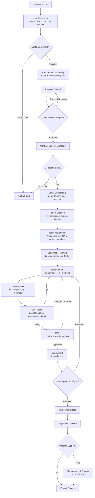

**Decision points, approvals & notifications by stage:**

| Stage | Decision Point | Approval Needed | Notification Fired | Status Change |
|---|---|---|---|---|
| Lead Generation | Is this a real inquiry? | Sales (spam filter) | Sales notified of new lead | `contact_submissions.status = new` |
| Sales Qualification | Fit for services/budget? | Sales lead/manager | — | Lead marked Qualified/Disqualified |
| Requirement Gathering | Scope clear enough to quote? | PM sign-off on feasibility | PM notified to join discovery | Lead → "Requirement Gathering" |
| Proposal | Pricing within standard bands? | Finance (if discount > threshold) | Client emailed proposal | Lead → "Proposal Sent" |
| Contract Approval | Client accepts terms? | Client signs; Admin/Finance countersigns | Sales + Finance notified | → "Contract Signed" |
| Client Onboarding | Account provisioned correctly? | Sales confirms details to PM | Client welcome email w/ portal login | → "Project Initiated" |
| Project Creation | Scope/budget/timeline locked? | PM + Finance (budget) | Team notified of new project | `projects.status = planning` |
| Team Assignment | Right skills available? | PM | Assigned Dev/QA notified | — |
| Sprint Planning | Backlog estimated? | PM | Team notified of sprint start | Tasks created (`todo`) |
| Development | Meets acceptance criteria? | Developer self-check | Task-status-changed to reviewer | `tasks.status = in_progress → in_review` |
| Code Review | Code quality/standards met? | Senior Dev/PM | Reviewer notified via GitHub/Slack | PR approved/changes requested |
| QA Testing | Defect-free vs. AC? | QA | Bug notifications to Developer | `tasks.status = done` or reopened |
| UAT | Client accepts the build? | Client | Client notified build is ready | `projects.status` stays `in_progress`, milestone flagged |
| Deployment | Prod readiness checklist done? | PM + DevOps | Client + internal team notified | Project milestone → "Live" |
| Client Approval | Final sign-off given? | Client | Finance notified to invoice | Triggers invoicing |
| Invoice Generation | Milestone/contract terms met? | Finance | Client emailed invoice | `invoices.status = sent` |
| Payment Collection | Payment received in full? | Finance reconciles | Payment-received receipt to client | `invoices.status = paid` |
| Maintenance/Support | New ticket raised? | Support triages | Client + Support notified | `tickets.status` lifecycle |
| Project Closure | All deliverables + payments settled? | PM + Finance + Client | Closure confirmation to all parties | `projects.status = completed` |

---

## 4. Project & Lead Lifecycle

> **Built:** the CRM pipeline described below is implemented — `app/models/lead.py`, `proposal.py`, `contract.py`, routers `leads.py` / `proposals.py` / `contracts.py`, migration `c3d4e5f6a7b8_add_crm_leads_proposals_contracts.py`. `Lead` links optionally to `ContactSubmission`; `Proposal` FKs to `Lead`; `Contract` FKs to `Proposal`. Signing a contract (`POST /contracts/{id}/sign`) auto-provisions the client's Supabase account + `Client` row when both signatures are recorded, marks the lead `converted`, and notifies `project_manager`/`admin` to kick off the project. Schema actually shipped:
> - `leads(id, contact_submission_id?, company, contact_name, email, phone, source, owner_id[sales], status, estimated_value, notes, converted_client_id, created_at)`
> - `proposals(id, lead_id, version, scope_summary, price, currency, sent_at, viewed_at, status[draft/sent/viewed/accepted/rejected], file_url, created_by)`
> - `contracts(id, proposal_id, signed_by_client_at, signed_by_company_at, document_url, status[pending/signed/void])`

| # | Status | Responsible Role | Required Action | Exit Criteria | Next Status |
|---|---|---|---|---|---|
| 1 | Lead Created | Sales (from Marketing/Guest) | Log contact details, assign owner | Lead has an owner + source recorded | Contacted |
| 2 | Contacted | Sales | Initial call/email, gauge interest | Interest confirmed or lead disqualified | Requirement Gathering / Closed-Lost |
| 3 | Requirement Gathering | Sales + PM | Discovery call, scope + budget range captured | Written requirements doc exists | Proposal Sent |
| 4 | Proposal Sent | Sales | Draft & send proposal with pricing/timeline | Client responds (accept/reject/negotiate) | Proposal Approved / back to Requirement Gathering |
| 5 | Proposal Approved | Sales + Client | Finalize terms | Verbal/written agreement on scope+price | Contract Signed |
| 6 | Contract Signed | Client + Admin/Finance | E-signature collected both sides | Signed contract on file | Project Initiated |
| 7 | Project Initiated | Sales → PM handoff | Create `Client` + `User` + `Project` records | Client has portal login; project row exists | Planning |
| 8 | Planning | Project Manager | Define scope, budget, milestones, assign team | Team assigned, backlog drafted | Development |
| 9 | Development | Developer | Build features per task backlog | All planned tasks reach `in_review` | Testing |
| 10 | Testing | QA | Execute test cases, log/fix bugs | All critical/high bugs closed | UAT |
| 11 | UAT | Client | Review staged build, approve or request changes | Client sign-off received | Ready for Deployment |
| 12 | Ready for Deployment | PM + DevOps | Final checklist, backup/rollback plan | Checklist complete, deployment window set | Live |
| 13 | Live | PM + Support | Deploy to production, monitor | Stable in production (no P1 within warranty window) | Under Maintenance |
| 14 | Under Maintenance | Support + Developer | Handle tickets/change requests per SLA/retainer | Contract/retainer period ends or client offboards | Closed |
| 15 | Closed | PM + Finance | Final invoice settled, docs archived, retro held | All invoices `paid`, project archived | — |

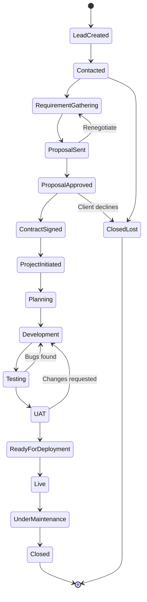

---

## 5. Role Interaction Matrix

| From ↓ / To → | Guest | Client | Sales | Marketing | PM | Developer | QA | Support | Finance | HR | Admin | Super Admin |
|---|---|---|---|---|---|---|---|---|---|---|---|---|
| **Guest** | — | — | Submits inquiry → | receives content from | — | — | — | — | — | Applies for job → | — | — |
| **Client** | — | — | Escalation on delivery/pricing ↔ | Submits testimonial → | Reviews reports, requests changes ↔ | — | — | Raises tickets ↔ | Pays invoices ↔ | — | — | — |
| **Sales** | Converts inquiry | Sends proposal, onboards ↔ | — | Receives routed leads ← | Hands off signed deal → | — | — | — | Requests contract sign-off ↔ | — | Requests account creation → | Escalates big deals → |
| **Marketing** | Publishes content to | — | Routes qualified leads → | — | — | — | — | — | — | — | Submits content for publish → | — |
| **PM** | — | Posts reports, requests sign-off ↔ | Receives kickoff, reports scope risk → | — | — | Assigns/reviews tasks ↔ | Reviews QA sign-off ↔ | Escalates prod bugs ↔ | Requests invoicing → | — | Reports project status → | Escalates blockers → |
| **Developer** | — | — | — | — | Reports status, raises blockers → | — | Hands off for testing ↔ | Fixes escalated bugs ← | — | — | — | — |
| **QA** | — | — | — | — | Reports sign-off, bug trends → | Returns bugs ↔ | — | — | — | — | — | — |
| **Support** | — | Resolves/replies to tickets ↔ | — | — | Escalates unresolved bugs → | Escalates confirmed bugs → | — | — | — | — | — | — |
| **Finance** | — | Sends invoices, payment reminders → | Approves discount thresholds ↔ | — | Confirms budget/invoicing ↔ | — | — | — | — | Views payroll costs → | Reports revenue → | Reports company finances → |
| **HR** | Reviews applications from ← | — | — | — | Coordinates staffing needs ↔ | Manages leave/attendance ↔ | Manages leave/attendance ↔ | Manages leave/attendance ↔ | Shares payroll input → | — | Reports headcount → | Reports org health → |
| **Admin** | Moderates content from | Manages account settings ↔ | Manages user/role access ↔ | Approves/publishes content ↔ | Views cross-project status ↔ | — | — | — | Views financial summaries ↔ | Views HR summaries ↔ | — | Reports to → |
| **Super Admin** | — | Can access any account (support) | Oversees all | Oversees all | Oversees all | Oversees all | Oversees all | Oversees all | Oversees all | Oversees all | Manages Admin accounts ↔ | — |

---

## 6. Approval Workflows

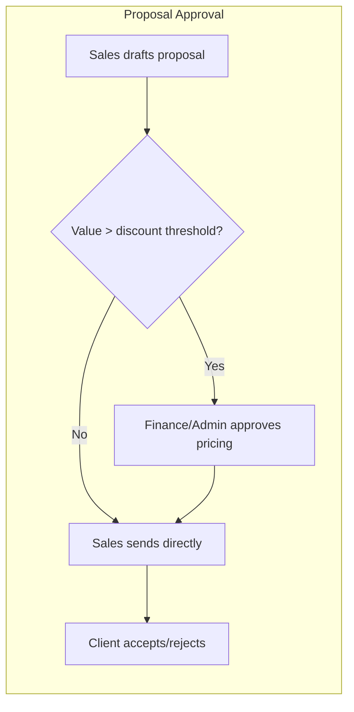

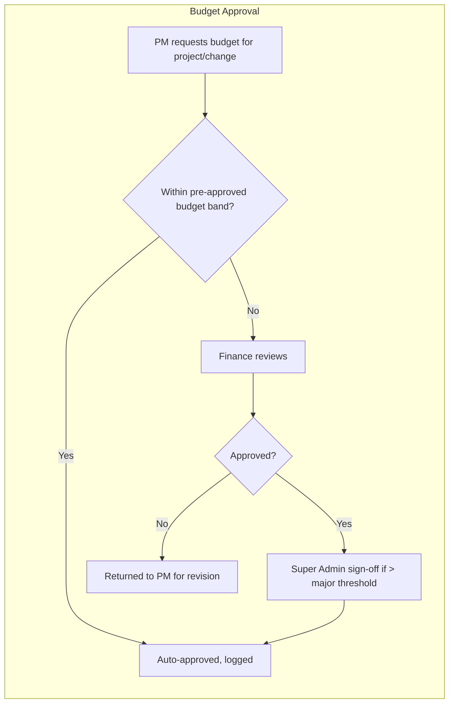

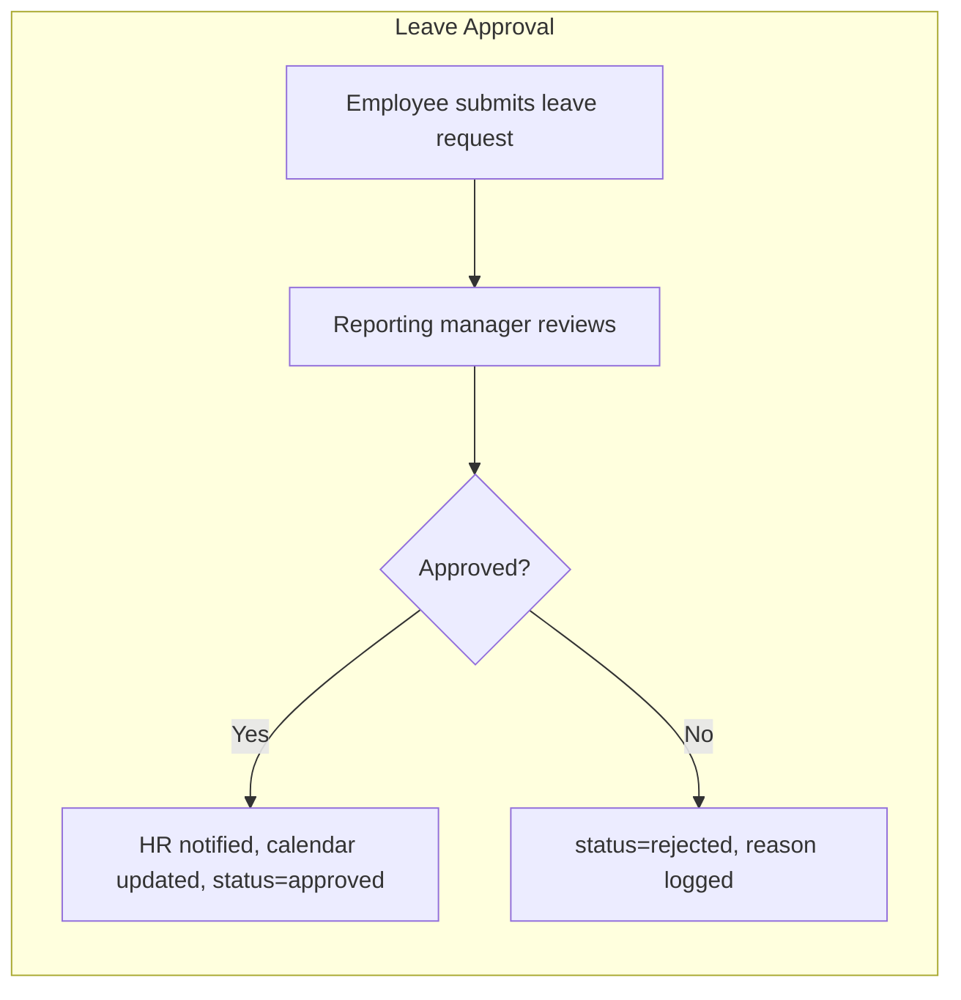

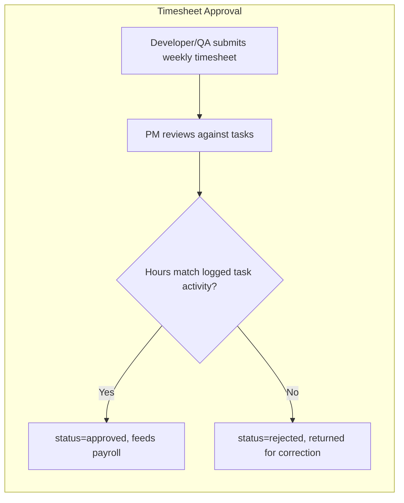

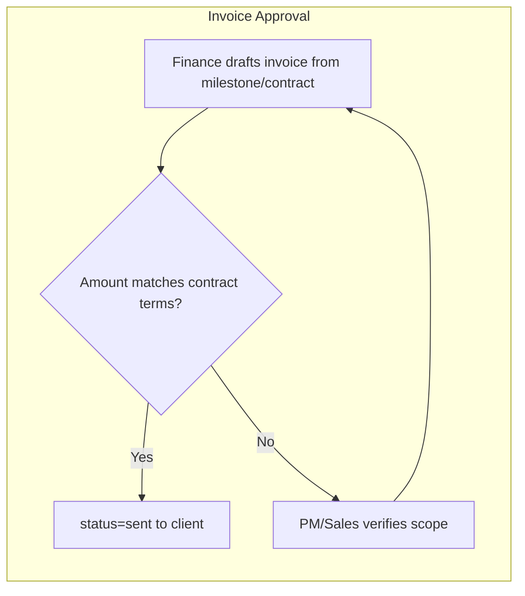

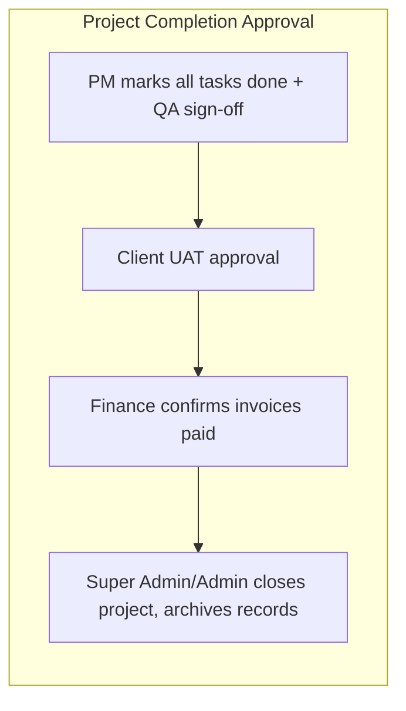

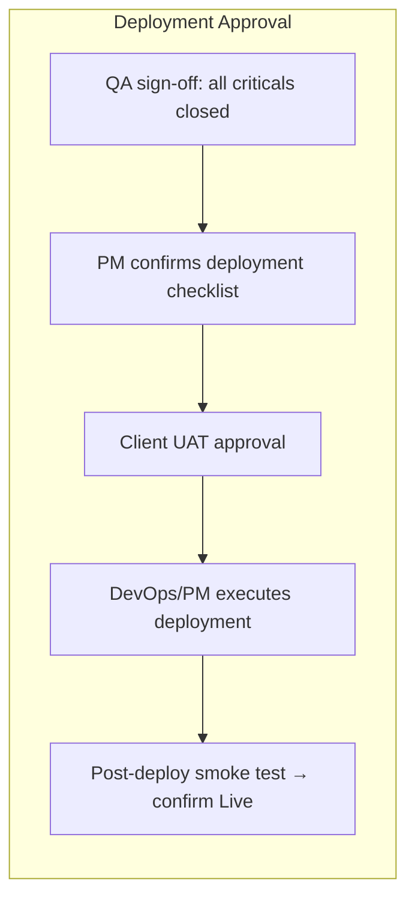

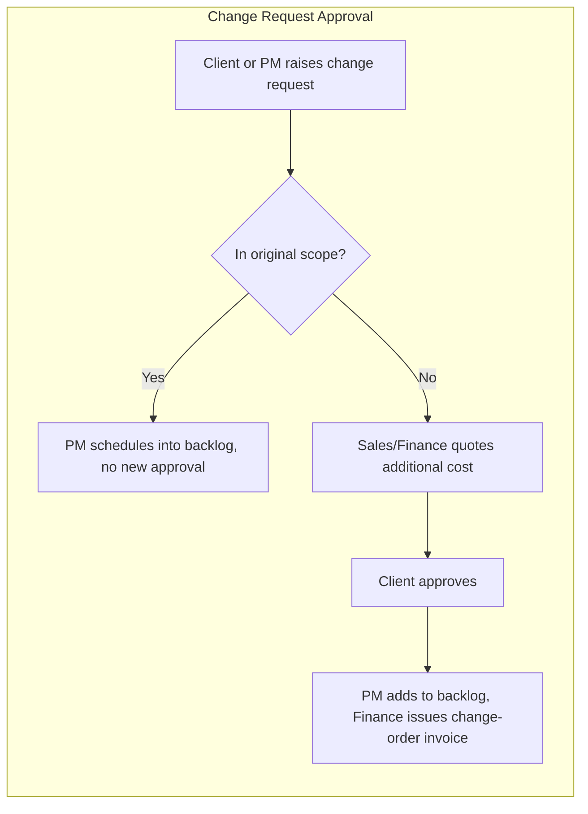

---

## 7. Dashboard Wireframes

```
Guest (no dashboard — public site only)
└── Navbar + Hero + Content Sections + Footer CTA

Client Dashboard
├── Statistics Row: [Active Projects] [Outstanding Balance] [Open Tickets] [Avg. Progress %]
├── Charts: Project Progress Ring · Invoice Status Donut
├── Recent Activity Feed
├── Upcoming Meetings (list)
├── Notifications Bell (dropdown)
├── Pending Actions: [Sign-off requests] [Unpaid invoices]
└── Quick Actions: Raise Ticket · Pay Invoice · Schedule Meeting

Sales Dashboard
├── Statistics Row: [Open Leads] [Proposals Pending] [MTD Bookings] [Conversion %]
├── Charts: Pipeline Funnel · Win/Loss Trend
├── Recent Activities (calls logged, proposals sent)
├── Follow-ups Due Today (list)
├── Notifications Bell
├── Pending Tasks: [Leads to qualify] [Contracts awaiting signature]
└── Quick Actions: Log Call · Send Proposal · Convert to Client

Marketing Dashboard
├── Statistics Row: [Sessions] [MQLs] [Newsletter Subs] [Content Published]
├── Charts: Traffic Trend · Lead Source Donut
├── Content Publish Queue
├── Recent Activity Feed
├── Notifications Bell
├── Pending Tasks: [Drafts awaiting publish] [Testimonials to moderate]
└── Quick Actions: New Post · New Case Study · Send Newsletter

Project Manager Dashboard
├── Statistics Row: [Active Projects] [Tasks at Risk] [Budget Burn %] [Team Utilization]
├── Charts: Delivery Timeline (Gantt) · Utilization Heatmap
├── Recent Activity Feed (task moves, QA sign-offs)
├── Calendar: Milestones & Standups
├── Notifications Bell
├── Pending Tasks: [Timesheets to approve] [Client reports due]
└── Quick Actions: New Project · Assign Task · Post Client Report

Developer Dashboard
├── Statistics Row: [My Open Tasks] [Hours Logged Today] [Due This Week] [Blocked]
├── Charts: My Task Status Breakdown (Kanban mini)
├── Recent Activity Feed (assignments, PR comments)
├── Calendar: Due Dates
├── Notifications Bell
├── Pending Tasks: [Tasks to move] [Leave requests pending]
└── Quick Actions: Log Time · Move Task · Raise Blocker

QA Dashboard
├── Statistics Row: [Test Queue] [Open Bugs] [Pass Rate %] [Regression Status]
├── Charts: Defect Trend · Pass/Fail by Sprint
├── Recent Activity Feed (bugs logged/closed)
├── Notifications Bell
├── Pending Tasks: [Tasks awaiting QA] [Regression run due]
└── Quick Actions: Log Bug · Mark Passed/Failed · Start Regression Run

Support Dashboard
├── Statistics Row: [Open Tickets] [SLA Breaches] [Avg Response Time] [CSAT]
├── Charts: Ticket Volume Trend · Priority Breakdown
├── Recent Activity Feed
├── Notifications Bell
├── Pending Tasks: [Unassigned tickets] [Escalations]
└── Quick Actions: Pick Up Ticket · Reply · Escalate

Finance Dashboard
├── Statistics Row: [Revenue MTD] [Outstanding Receivables] [Overdue Invoices] [Payroll Status]
├── Charts: Cash Flow Trend · AR Aging Buckets
├── Recent Activity Feed (payments received)
├── Notifications Bell
├── Pending Tasks: [Invoices to send] [Proposals awaiting approval]
└── Quick Actions: Create Invoice · Record Payment · Run Payroll

HR Dashboard
├── Statistics Row: [Headcount] [Open Positions] [Pending Leaves] [Attendance Anomalies]
├── Charts: Headcount by Department · Recruitment Funnel
├── Recent Activity Feed
├── Calendar: Reviews Due
├── Notifications Bell
├── Pending Tasks: [Leave approvals] [Interviews to schedule]
└── Quick Actions: Post Job · Approve Leave · Add Employee

Admin Dashboard
├── Statistics Row: [Total Users] [Active Projects] [Open Tickets] [MRR]
├── Charts: User Growth · Revenue Snapshot
├── Recent Audit Log Entries
├── Notifications Bell
├── Pending Tasks: [Content to publish] [Role change requests]
└── Quick Actions: Add User · Publish Content · Manage Roles

Super Admin Dashboard
├── Statistics Row: [Company Revenue] [Delivery On-Time %] [Headcount] [Uptime %]
├── Charts: Consolidated Executive Summary (all departments)
├── Full Audit Trail (filterable)
├── Notifications Bell
├── Pending Tasks: [GDPR requests] [Irreversible actions awaiting sign-off]
└── Quick Actions: Manage Admins · System Settings · Impersonate User
```

---

## 8. Database Mapping

| Module | Main Tables (existing) | Key Relationships | CRUD Operations | Role Permissions |
|---|---|---|---|---|
| Identity/RBAC | `users`, `roles`, `permissions`, `role_permissions` | users.role (enum) · roles↔permissions (M:N) | C/R/U (Super Admin), R (all) | Super Admin: full · Admin: R/U (below system roles) · others: R (self) |
| CRM/Leads *(GAP)* | `contact_submissions` (existing) + **new** `leads`, `proposals`, `contracts` | leads→contact_submissions (0:1) · proposals→leads (1:N) · contracts→proposals (1:1) | CRUD (Sales), R (PM, Finance for approval) | Sales: CRUD · Finance: approve · Admin: R |
| Clients | `clients` | clients.user_id→users · clients.account_manager_id→employees | CRUD (Sales/Admin), R (PM/Finance/Support) | Sales: CRUD own · PM/Finance/Support: R |
| Projects | `projects`, `project_members` (assoc) | projects.client_id→clients · projects.project_manager_id→users · project_members↔employees (M:N) | CRUD (PM/Admin), R (Client own, Dev/QA assigned) | PM: CRUD own · Client: R own · Dev/QA: R assigned |
| Tasks | `tasks` | tasks.project_id→projects · tasks.assigned_to→users | CRUD (PM), U status (Dev/QA own) | PM: CRUD · Dev: U (own, status/notes) · QA: U (status, sign-off) |
| Timesheets | `timesheets` | timesheets.employee_id→employees · timesheets.task_id→tasks | C/U (own, Employee), Approve (PM/HR) | Employee: CRUD own draft · PM: Approve |
| Attendance/Leave | `attendance`, `leaves` | both →employees | C (own, Employee), Approve (HR/Manager) | Employee: C own · HR: Approve/R all |
| Payroll | `payslips` | payslips.employee_id→employees, salary from `employees.salary` | CRUD (Finance) | Finance: CRUD · Employee: R own |
| Performance/Training | `performance_reviews`, `trainings` | →employees | CRUD (HR), R (Employee own) | HR: CRUD · Employee: R own |
| Recruitment | `careers`, `applications` | applications.career_id→careers | CRUD (HR), C (Guest applies) | HR: CRUD · Guest: C only |
| Invoices/Payments | `invoices`, `payments` | invoices.client_id→clients · invoices.project_id→projects · payments.invoice_id→invoices | CRUD (Finance), R (Client/PM own) | Finance: CRUD · Client: R+Pay own · PM: R own |
| Support | `tickets`, `ticket_replies` | tickets.client_id→clients · tickets.assigned_to→users | CRUD (Support), C (Client) | Support: CRUD · Client: C/R own |
| Client Collaboration | `client_files`, `client_reports`, `meetings` | all →clients, meetings→clients/projects | CRUD (PM/Support), R (Client) | PM: CRUD · Client: R + approve reports |
| CMS Content | `blogs`, `case_studies`, `services`, `solutions`, `products`, `technologies`, `industries`, `portfolios`, `events`, `gallery`, `awards`, `downloads`, `resources`, `faqs`, `partners`, `testimonials`, `page_content`, `seo` | most →`categories` | CRUD (Marketing/Admin), R (Guest) | Marketing: CRUD · Admin: CRUD+publish · Guest: R published only |
| Notifications | `notifications` | →users | C (system/any role triggering), R/U (own, mark read) | All: R/U own · System: C |
| Audit | `audit_logs` | →users (actor) | C (system-generated on every mutating action), R (Admin/Super Admin) | Admin/Super Admin: R · System: C only, immutable |
| Settings | `settings` | key/value, global | R/U (Admin/Super Admin) | Super Admin: U · Admin: R/U (non-critical keys) |
| Departments | `departments` | departments↔employees (1:N) | CRUD (Super Admin/HR) | Super Admin: CRUD · HR: R/U |

---

## 9. API Mapping

Grounded in the real router modules under `backend/app/routers/`. Each already-implemented router is marked ✅; net-new endpoints needed for the CRM gap are marked 🆕.

| Module | Router file | Core Endpoints |
|---|---|---|
| Authentication | `auth.py` ✅ | `POST /auth/signup` · `POST /auth/login` · `POST /auth/logout` · `POST /auth/refresh` · `GET /auth/me` · `POST /auth/reset-password` |
| Users | `users.py` ✅ | `GET/POST /users` · `GET/PUT/DELETE /users/{id}` · `PUT /users/{id}/role` |
| Roles/Permissions | `role.py` ✅ | `GET/POST /roles` · `PUT/DELETE /roles/{id}` · `POST /roles/{id}/permissions` |
| Clients | `clients.py` ✅ | `GET/POST /clients` · `GET/PUT /clients/{id}` · `GET /clients/{id}/projects` |
| Leads/Proposals/Contracts | `leads.py`, `proposals.py`, `contracts.py` ✅ | `GET/POST /leads` · `PUT /leads/{id}/status` · `POST /leads/{id}/proposals` · `POST /proposals/{id}/send` · `POST /contracts/{id}/sign` |
| Projects | `projects.py` ✅ | `GET/POST /projects` · `GET/PUT/DELETE /projects/{id}` · `POST /projects/{id}/members` |
| Tasks | `task.py` ✅ | `GET/POST /tasks` · `PUT /tasks/{id}` · `PUT /tasks/{id}/status` · `GET /projects/{id}/tasks` |
| Employees | `employees.py` ✅ | `GET/POST /employees` · `GET/PUT/DELETE /employees/{id}` · `GET /employees/{id}/timesheets` |
| Departments | via `employees.py`/models ✅ | `GET/POST /departments` |
| Attendance/Leave/Timesheet | within `employees.py` ✅ | `POST /attendance/checkin` · `GET/POST /leaves` · `PUT /leaves/{id}/approve` · `GET/POST /timesheets` · `PUT /timesheets/{id}/approve` |
| Performance/Training | `performance_review.py`, `training.py` ✅ | `GET/POST /performance-reviews` · `GET/POST /trainings` |
| Recruitment | `career.py` ✅ | `GET/POST /careers` · `POST /careers/{id}/apply` · `PUT /applications/{id}/status` |
| Finance/Invoices/Payments | `finance.py` ✅ | `GET/POST /invoices` · `PUT /invoices/{id}/status` · `POST /payments` · `GET /reports/revenue` |
| Payroll | within `finance.py`/`employees.py` ✅ | `GET/POST /payslips` · `POST /payroll/run` |
| Tickets | `ticket.py` ✅ | `GET/POST /tickets` · `PUT /tickets/{id}` · `POST /tickets/{id}/replies` |
| Meetings | `meeting.py` ✅ | `GET/POST /meetings` · `PUT /meetings/{id}` |
| Client Files/Reports | within `clients.py` ✅ | `GET/POST /clients/{id}/files` · `GET/POST /clients/{id}/reports` |
| Notifications | `notification.py` ✅ | `GET /notifications` · `PUT /notifications/{id}/read` · `POST /notifications/broadcast` |
| Reports/Analytics | `reports.py`, `analytics.py`, `stats.py`, `dashboard.py` ✅ | `GET /reports/{type}` · `GET /analytics/summary` · `GET /stats` · `GET /dashboard/{role}` |
| Audit Log | `audit_log.py` ✅ | `GET /audit-logs` (filter by user/module/action) |
| CMS Content | `blog.py`, `case_study.py`, `service.py`, `solution.py`, `product.py`, `technology.py`, `industry.py`, `portfolio.py`, `event.py`, `gallery.py`, `award.py`, `download.py`, `resource.py`, `faq.py`, `partner.py`, `testimonial.py`, `page_content.py`, `seo.py`, `category.py` ✅ | `GET/POST /{resource}` · `GET/PUT/DELETE /{resource}/{id}` (public `GET` unauthenticated for published items) |
| Contact | `contact.py` ✅ | `POST /contact` · `GET/PUT /contact-submissions/{id}` |
| Newsletter | `newsletter.py` ✅ | `POST /newsletter/subscribe` · `GET /newsletter/subscribers` |
| Settings | `setting.py` ✅ | `GET/PUT /settings` |
| GDPR | `gdpr.py` ✅ | `POST /gdpr/export` · `POST /gdpr/erase` |
| Media | `media.py` ✅ | `POST /media/upload` · `GET/DELETE /media/{id}` |

---

## 10. UI Screens by Role

Mapped against real frontend surfaces: **public site** (26 route pages), **`ClientPortal.jsx`**, **`EmployeePortal.jsx`** (currently one generic tab set — needs role-conditional tab variants per §2), **`AdminPanel.jsx`**, **`PartnerPortal.jsx`**.

| Role | Screens |
|---|---|
| Guest | Home · Services · Solutions · Products · Technologies · Industries · Portfolio · Case Studies · About · Careers · Blog · Events · Gallery · Awards · Downloads · Resources · FAQ · Contact · Login Modal · Register (invite-only) |
| Client | Overview · Projects (list/detail) · Invoices & Payments · Files · Reports · Meetings · Support Tickets · Testimonials · Profile & Settings |
| Sales | Dashboard · Leads · Clients · Proposals · Contracts · Meetings/Demos · Reports · Settings |
| Marketing | Dashboard · Content (Blog/Case Studies/Events/Gallery/Awards/Downloads/Resources) · Page Content & SEO · Newsletter · Leads Handoff · Reports |
| Project Manager | Dashboard · Projects (list/detail: Tasks/Timeline/Files/Budget/Team) · Tasks Kanban · Team · Client Reports · Meetings · Change Requests 🆕 · Reports |
| Developer | Dashboard · My Tasks (Kanban) · My Projects · Timesheets · Attendance · Leaves · Payslips · Training · Documents |
| QA | Dashboard · Test Queue · Bug Tracker · Test Cases 🆕 · My Projects · Timesheets · Reports |
| Support | Dashboard · Ticket Queue · Knowledge Base 🆕 · Escalations · Clients (read-only) · Reports |
| Finance | Dashboard · Invoices · Payments · Payroll · Expenses 🆕 · Clients (billing view) · Reports |
| HR | Dashboard · Employees · Recruitment (Careers/Applications) · Attendance · Leaves · Timesheets · Performance Reviews · Training · Documents · Reports |
| Admin | Dashboard (overview) · Content · Projects · Users · Employees · Clients · Roles · Analytics · Media · Notifications · Reports · Settings · Audit Logs |
| Super Admin | All Admin screens · Departments · Global Role & Permission Matrix · Billing & Subscription · Data Export/GDPR · System Settings · Impersonation |

### Implementation checklist for engineering handoff

- [x] Build `leads`, `proposals`, `contracts` models + Alembic migration + `leads.py`/`proposals.py`/`contracts.py` routers + frontend `api/crm.js` + Sales-only tabs in `EmployeePortal.jsx`
- [x] Extend role-conditional tab configs to Marketing (Leads Handoff, Testimonial moderation), Project Manager (Team Projects, Task Board, Approvals), QA (Test Queue), Support (Ticket Queue), Finance (Invoices), HR (Leave Approvals, Recruitment) — see `rolePortalTabs` in `data/portal.js`. Developer keeps the generic shared tab set (it already matches the doc's Developer nav). All reuse existing routers except two new endpoints added for this: `GET/PATCH /employees/leaves` and `/employees/timesheets` (approval), since HR/PM previously had no way to review submitted leave/timesheets at all.
- [ ] Still open: PM Change Requests, QA dedicated Test Cases/Runs model, Support Knowledge Base, Finance Expenses (all still GAP per §2, reusing `tasks`/nothing as a stand-in where noted)
- [ ] Add `test_cases`/`test_runs` models for the QA module (currently QA reuses `tasks`)
- [ ] Add a `Sprint`/`Milestone` model if formal sprint planning is required (currently flat `tasks` per `project`)
- [ ] Extend `Permission.action` set to consistently cover `view/create/edit/delete/approve/export/assign/manage` per module, and wire `role_permissions` UI into `AdminPanel.jsx → Roles` tab
- [ ] Add `expenses` model for Finance if company-expense tracking (not just client invoicing) is in scope
- [ ] Add a lightweight `knowledge_base`/`kb_articles` model for Support (or repurpose `resource.py`)
